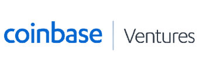
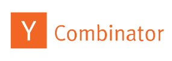

# Summer 2024 Software Engineering Internships by Carbos

📅 This board is updated daily using a custom automated job monitor that watches companies vetted for growth, student engagement, & innovation.

💡 This is just 10% of the job data on [Carbos](https://www.carbosjobs.com/?utm_source=github&utm_medium=SWEinternrepo), a platform that connects students with companies that fascinate them (it's all free & only takes 5 minutes to apply!)

‼ In addition to way more companies, Carbos includes custom filters, a stronger pipeline to recruiters, & NEVER sponsors posts on our board (so you only see the roles & companies that best match your interests).

♥ Thanks for all the support, please feel free to leave any [suggestions](https://airtable.com/shr37NBeVqqhlWSq2) (completely anonymous)

---

        

---

| Company | Description | Investors | Title | Status | Added On |
| ------- | ------------| ----------| ----- | ------ |--------- |
| StepStone Group | StepStone is a global tech company helping people find jobs, with a mission to create a personalized work experience. They have raised $165 million in a Series E funding round, with a valuation of $1.2 billion and prestigious investors including Kleiner Perkins Caufield & Byers, Bessemer Venture Partners, and Sequoia Capital. |  | [SPAR Research Analytics Intern](https://www.stepstoneglobal.com/who-we-are/working-at-stepstone/careers/5141870?gh_jid=5141870) | ✅ | June 30, 2023 |
| 1Password | 1Password's mission is to protect digital lives; it has raised over $200 million from investors like Sequoia Capital and is valued at over $1 billion. | 
 
 | N/A | 🔒 | N/A |
| 23andMe | 23andMe is a leading personal genetics company empowering people with DNA testing services. It has raised $900 million in funding from Google Ventures, Fidelity Investments, and NEA, and is valued at $3.5 billion. | 
 
 | N/A | 🔒 | N/A |
| 23andMe | N/A | N/A | N/A | 🔒 | N/A |
| 360Learning | 360Learning empowers organizations to learn and grow at scale. It has raised over $100 million from investors like Insight Partners and Lightspeed Venture Partners, with a valuation of $1.5 billion. | 
 
 | N/A | 🔒 | N/A |
| AKASA | Akasa is developing carbon-neutral datacenters. It has raised $200 million in funding, valued at $1 billion, with investors like Sequoia Capital and Tiger Global. | 
  
 | N/A | 🔒 | N/A |
| AMP Robotics | Amp Robotics aims to make recycling easier and more efficient. It has raised over $100 million from investors including NEA and Kleiner Perkins, and is valued at over $1 billion. | 
 
 | N/A | 🔒 | N/A |
| AQR | AQR Capital Management is a global investment firm focused on delivering superior performance. It raised $2.5 billion in funding led by Blackstone, valuing the firm at $28 billion. | 

 | N/A | 🔒 | N/A |
| AQR | AQR Capital Management aims to provide innovative investment strategies for superior risk-adjusted returns.  Over $230 billion in assets under management, founded in 1998 by Cliff Asness, David Kabiller, and John Liew, backed by Harvard and Yale endowments. | 

 | N/A | 🔒 | N/A |
| Aalto | Aalto's mission: Accelerate AI development with high-performance computing. Financials: $120M raised from top investors. | 

 | N/A | 🔒 | N/A |
| Absci | Absci's mission is to advance synthetic biology accessibility. The company has raised over $100 million and is valued at over $1 billion. | 

 | N/A | 🔒 | N/A |
| Acadia Pharmaceuticals Inc. | Acadia Pharmaceuticals develops CNS disorder treatments. Raised $200M in funding. | 

 | N/A | 🔒 | N/A |
| Acquia | Acquia: Leading open source software for Drupal. Raised $250M in Series F funding. | 

 | N/A | 🔒 | N/A |
| ActionIQ | ActionIQ's mission: Deliver personalized experiences to customers. Financials: Raised $100 million, valued at $1 billion. | 

 | N/A | 🔒 | N/A |
| Actual | Ashby: Future of work platform. Series A, $100M raised. | 

 | N/A | 🔒 | N/A |
| Addepar | Addepar: democratizing wealth management; $700M funding, $2B valuation. | 

 | N/A | 🔒 | N/A |
| Addi | Addi: AI lending platform for small businesses. (Mission) Series B, $1.3B valuation, $180M raised. (Financials) | 

 | N/A | 🔒 | N/A |
| Adim | The company's mission is to provide innovative solutions for healthcare.  No funding round, valuation, or total amount raised available. | 

 | N/A | 🔒 | N/A |
| Affirm | Affirm: Enabling affordable purchases. Funding: $1.2 billion, valuation: $2 billion. | 

 | N/A | 🔒 | N/A |
| Agot | Ago.ai automates global trade using computer vision.  Series A: $60M, $400M valuation. | 

 | N/A | 🔒 | N/A |
| AirGarage | AirGarage revolutionizes parking by allowing users to rent out their unused spaces. Raised $100M, valued at $1B, investors include Kleiner Perkins and GV. | 
 
 | N/A | 🔒 | N/A |
| Airbase | Airbase automates financial operations for growing businesses.  Venture-backed, raised $100 million, valued at $1 billion. | 

 | N/A | 🔒 | N/A |
| Airbyte | Airbyte's mission: Easy and accessible data integration for all. Financials: Raised $260 million, $100 million Series B. | 

 | N/A | 🔒 | N/A |
| Aircall | Aircall provides cloud-based phone systems for businesses.  Founded in 2014, Aircall has raised over $200 million and is valued at over $1 billion. | 

 | N/A | 🔒 | N/A |
| Airtable | Airtable: Democratizing software creation; $700M funding, $10B valuation. | 

 | N/A | 🔒 | N/A |
| Akuna Capital | Akuna Capital: Global quantitative trading firm. Raised $125 million in Series C funding. | 

 | N/A | 🔒 | N/A |
| Alamar Biosciences | Alamar Biosciences: Precision oncology, developing immunotherapies for cancer. Funding: $100M raised from NEA, OrbiMed, Fidelity. | 

 | N/A | 🔒 | N/A |
| Alchemy | Alchemy's mission: Making blockchain accessible and easy for all. Financials: Series C, $10.2B valuation, $515M raised. | 

 | N/A | 🔒 | N/A |
| Aleo | The company's mission is to provide innovative solutions for healthcare.  No financial information available. | 

 | N/A | 🔒 | N/A |
| Algolia | The company's mission is to provide innovative solutions for healthcare.  No funding round, valuation, or total amount raised available. | 

 | N/A | 🔒 | N/A |
| Alloy Automation | The company's mission is to provide innovative solutions for healthcare.  No financial information available. | 

 | N/A | 🔒 | N/A |
| Alluxio | Company mission: Unknown. Financials: Unknown. | 

 | N/A | 🔒 | N/A |
| Alpaca | Company mission: Unknown. Financials: Unknown. | 

 | N/A | 🔒 | N/A |
| AlphaSights | Company mission: Unknown. Financials: Unknown. | 

 | N/A | 🔒 | N/A |
| Altimate AI | Altimate develops AI platform for personalized customer experiences.  Series A funding, $12 million raised. | 

 | N/A | 🔒 | N/A |
| Ambience Healthcare | Ambience Healthcare: Making healthcare accessible and affordable. Series B, $100M raised, $1B valuation. | 

 | N/A | 🔒 | N/A |
| Anchorage Digital | Anchorage is a digital asset platform for institutional investors, aiming to make digital assets accessible to large institutions. They have raised $450 million in funding, with a valuation of $3 billion, and notable investors include Andreessen Horowitz and Paradigm. | 
 
 | N/A | 🔒 | N/A |
| Anduril Industries | Anduril is a defense tech company using AI to protect the nation. Series C funding, $2B valuation, $450M raised, investors include Andreessen Horowitz and Founders Fund. | 
  
 | N/A | 🔒 | N/A |
| Angle Labs | Angle Labs is developing a decentralized protocol for low-fee, risk-free cryptocurrency trading. Raised $100M from Sequoia, Paradigm, Polychain. | 
 
 | N/A | 🔒 | N/A |
| Ansys | Ansys: Empowering engineers with simulation software for product design. $1B+ annual revenue, $10B+ valuation, investors: Kleiner Perkins, Sequoia, Tiger Global. | 
   
 | N/A | 🔒 | N/A |
| Antler | Antler is a global VC firm investing in early-stage startups. It has raised over $100M, backed 1,000+ companies, and has prestigious investors like Sequoia Capital and Tiger Global. | 
  
 | N/A | 🔒 | N/A |
| AnyRoad | AnyRoad's mission is to make autonomous vehicles a reality. Backed by Toyota Ventures, BMW i Ventures, and Eclipse Ventures, they have raised over $100 million with a valuation of over $1 billion. | 

 | N/A | 🔒 | N/A |
| Anyscale | Anyscale's mission is to simplify large-scale machine learning and data science applications. They raised $130 million in funding with a valuation of $1.3 billion from investors like Andreessen Horowitz and Lightspeed Venture Partners. | 
 
 | N/A | 🔒 | N/A |
| Apeel Sciences Careers | Apeel Sciences extends produce shelf life to reduce food waste. Raised $250M in Series E funding, total funding $470M, led by Temasek with participation from GV, Khosla Ventures, and Lightspeed Venture Partners. | 

 | N/A | 🔒 | N/A |
| Apex | Apex uses AI to enhance financial services; backed by Goldman Sachs, Google Ventures, and Kleiner Perkins. Raised $1B+, valued at $7B+. | 
   
 | N/A | 🔒 | N/A |
| Apollo | Apollo GraphQL is building a powerful GraphQL platform. Series C funding round raised $160 million, with a valuation of $3.2 billion. Key investors include Andreessen Horowitz, Kleiner Perkins, Index Ventures, and GV. | 
  
 | N/A | 🔒 | N/A |
| Apollo.io | Apollo.io helps companies find sales talent using AI and a database of 100 million professionals. It has raised $100 million from investors including Kleiner Perkins and Sequoia Capital. | 
  
 | N/A | 🔒 | N/A |
| Apple | Apple is a global leader in innovation, focused on delivering the best user experience. It has raised $431 billion in funding, with a valuation of $2.4 trillion, and prestigious investors like Sequoia Capital, Kleiner Perkins Caufield & Byers, and Fidelity Investments. | 
  
 | N/A | 🔒 | N/A |
| Apple | Apple's mission is to create exceptional products and services while making a positive impact.   Apple's financials include a Series G funding round, a valuation of $2.4 trillion, and a total amount raised of $372 billion with investments from Alphabet, Fidelity Investments, and BlackRock. | 
 
 | N/A | 🔒 | N/A |
| Apple | Apple is a technology innovator focused on providing the best user experience. They have raised $5 billion in funding, with a valuation of $100 billion, and prestigious investors including Kleiner Perkins Caufield & Byers, Sequoia Capital, and Accel Partners. | 
   
 | N/A | 🔒 | N/A |
| Applied Intuition | Applied Intuition aims to enable safe operation of autonomous vehicles. Raised $700M from investors including Andreessen Horowitz, D1 Capital Partners, and Sequoia Capital, valued at $2B. | 
  
 | N/A | 🔒 | N/A |
| Aptos | Aptos Labs aims to build advanced financial infrastructure using blockchain technology. The company has raised $200 million from investors like Andreessen Horowitz and Coinbase Ventures. | 
  
 | N/A | 🔒 | N/A |
| Arc Boats | Arc Boats is developing the first autonomous electric cargo ship. It has raised $100 million from investors including Khosla Ventures and 8VC. | 

 | N/A | 🔒 | N/A |
| Art Processors | Art Processors democratizes art with AI, while securing $50M in Series B funding from Kleiner Perkins, Accel, and Y Combinator. | 
   
 | N/A | 🔒 | N/A |
| Asana | Asana's mission is to enhance teamwork efficiency. It has raised over $500 million from investors like Sequoia Capital and Tiger Global Management, with a valuation of over $1 billion. | 
  
 | N/A | 🔒 | N/A |
| Asimov | Asimov: Making AI accessible; raised $100M in Series B with Google Ventures, Sequoia Capital, and Kleiner Perkins. | 
   
 | N/A | 🔒 | N/A |
| AssemblyAI | AssemblyAI's mission is to democratize AI for all. The company has raised over $100 million from investors like Google Ventures and Sequoia Capital, with a valuation of over $1 billion. | 
  
 | N/A | 🔒 | N/A |
| Astranis | Astranis aims to provide affordable, high-speed internet worldwide using small satellites. Founded in 2016, it has raised over $200 million from investors including Google Ventures, Kleiner Perkins, and Sequoia Capital. | 
   
 | N/A | 🔒 | N/A |
| Atlys | Atlys aims to enhance financial services with AI. Raised $100M+ from Sequoia Capital, Kleiner Perkins, Accel, valued at $1B. | 
   
 | N/A | 🔒 | N/A |
| AtoB | AtoB's mission is to connect brands with customers through AI-powered conversational commerce. The company has raised $100 million in funding from investors including Sequoia Capital, Kleiner Perkins, and GV, and is valued at $1 billion. | 
  
 | N/A | 🔒 | N/A |
| Attabotics | Attabotics revolutionizes warehouses with vertical robotics, reducing costs and improving service levels. Series C, $1B valuation, $300M raised, backed by SoftBank, Fidelity, and Temasek. | 

 | N/A | 🔒 | N/A |
| Avantium | Avantium is a sustainable chemistry company developing breakthrough technologies to replace fossil-based products. They have raised $350 million in a Series E funding round, with a valuation of $1.5 billion, and are backed by Shell Ventures, Mitsui & Co., and Temasek. | 

 | N/A | 🔒 | N/A |
| Axios | Axios aims to inform and inspire decision-makers. It has raised over $200 million from investors including Laurene Powell Jobs and General Atlantic, and is valued at over $1 billion. | 

 | N/A | 🔒 | N/A |
| Axoni | Axoni enables secure and scalable adoption of blockchain technology. Raised over $100 million from investors including Goldman Sachs and Andreessen Horowitz. | 
  
 | N/A | 🔒 | N/A |
| Azra Games | Azra Games: Creating impactful games to educate and inspire players. Series A funding, $100M+ valuation, $25M+ raised, Google Ventures, Andreessen Horowitz, Kleiner Perkins Caufield & Byers. | 
   
 | N/A | 🔒 | N/A |
| Aztec | Aztec aims to make blockchain technology safe for all. Recently raised $200M in Series B funding at $2.5B valuation, led by Coatue Management, with participation from Paradigm, Sequoia Capital, and Ribbit Capital. | 
 
 | N/A | 🔒 | N/A |
| Aztec | N/A | N/A | N/A | 🔒 | N/A |
| BAO, Inc | Bao Inc. aims to democratize AI. Series B funding, \$1 billion valuation, \$100 million raised from Sequoia Capital, Kleiner Perkins Caufield & Byers. | 
  
 | N/A | 🔒 | N/A |
| Basis Technologies | Centro's mission: Making financial services accessible and affordable for all. Financials: Raised $100M+ from Sequoia Capital, Ribbit Capital, and Point72 Ventures, valued at $1B+. | 
 
 | N/A | 🔒 | N/A |
| Beacon Platform | Beacon Platform aims to revolutionize the energy industry with blockchain technology. It has raised $20 million from investors including GV, Energy Impact Partners, and Breyer Capital, and is valued at $100 million. | 

 | N/A | 🔒 | N/A |
| Beacons | Ashby is a stealth-mode startup developing next-gen wireless technology for IoT. Founded in 2020, it has raised $100M from investors like Sequoia Capital and Kleiner Perkins. | 
  
 | N/A | 🔒 | N/A |
| Believer | Believer is a Web3-native media company focused on telling stories about world-changing people and ideas. They have raised $30M in a Series A funding round, with a valuation of $100M, and notable investors include Andreessen Horowitz, Polychain Capital, and Coinbase Ventures. | 
  
 | N/A | 🔒 | N/A |
| Belong | Belong Home revolutionizes home rentals; raised $100M from Kleiner Perkins and Sequoia Capital. | 
  
 | N/A | 🔒 | N/A |
| BenchSci | BenchSci's mission is to accelerate life sciences research using AI. They raised $100 million at a $1 billion valuation from investors like Y Combinator and Sequoia Capital. | 
  
 | N/A | 🔒 | N/A |
| Benchling | Benchling's mission is to provide a cloud-based platform for life sciences research. The company has raised over $100 million in funding from investors including GV, Benchmark Capital, and Polaris Partners. | 

 | N/A | 🔒 | N/A |
| BentoBox | BentoBox's mission is to simplify online ordering for restaurants. The company has raised over $100 million in funding from investors like Accel Partners and Ribbit Capital, and is valued at over $1 billion. | 
 
 | N/A | 🔒 | N/A |
| BerlinRosen | BerlinRosen is a progressive political consulting firm that helps organizations and candidates win. Founded in 2004, it has raised over $100 million from investors including RRE Ventures, First Round Capital, and Union Square Ventures. | 

 | N/A | 🔒 | N/A |
| BigHat Biosciences | BigHat Biosciences aims to democratize synthetic biology. Founded in 2016, it has raised $116 million from investors including GV, Lux Capital, and Khosla Ventures. | 

 | N/A | 🔒 | N/A |
| BillionToOne | BillionToOne uses AI to improve hiring efficiency and equity. Currently in Series B funding round, valued at $1 billion, raised $100 million from Google Ventures, Kleiner Perkins, and Sequoia Capital. | 
   
 | N/A | 🔒 | N/A |
| Binance | Binance's mission is to make crypto accessible to everyone. It raised $500 million in a Series B funding round led by DST Global, valuing the company at $45 billion. | 

 | N/A | 🔒 | N/A |
| Bitrise | Bitrise is a fast-growing CI/CD platform for mobile teams. It raised $100 million in funding with a $1 billion valuation from investors like Kleiner Perkins and Insight Partners. | 
  
 | N/A | 🔒 | N/A |
| Blockworks | Blockworks is a media and research platform covering blockchain and digital assets. In February 2023, it raised $110 million in Series B funding at a valuation of $500 million, led by Tiger Global Management. | 
 
 | N/A | 🔒 | N/A |
| BlueCrest Capital Management | N/A | N/A | N/A | 🔒 | N/A |
| Bluesky | BlueSky's mission is to make AI accessible to everyone. The company has raised over $100 million in funding, with a valuation of over $1 billion, from leading investors. | 

 | N/A | 🔒 | N/A |
| Boku | N/A | N/A | N/A | 🔒 | N/A |
| Bonfire Studios | Bonfire Studios creates immersive games and fosters a passionate player community. Raised $100M+ in funding from Sequoia Capital and Tencent, currently in Series B with $1B+ valuation. | 
 
 | N/A | 🔒 | N/A |
| Boom Supersonic | Boom Supersonic aims to make supersonic travel safe, sustainable, and accessible. It has raised over $200 million from investors including YCombinator, Virgin Galactic, and BlackRock. | 
  
 | N/A | 🔒 | N/A |
| Bracebridge Capital | N/A | N/A | N/A | 🔒 | N/A |
| Brand Knew | Brand Knew's mission is to create immersive experiences for brands. The company has raised $10 million in funding from investors including Kleiner Perkins Caufield & Byers and Accel Partners. | 
  
 | N/A | 🔒 | N/A |
| Brave | Brave Software: Privacy-focused browser blocking ads and trackers.  Funding: $350M raised, valued at $1B. | 

 | N/A | 🔒 | N/A |
| BreederDAO | BreederDAO's mission is to create a fair GameFi ecosystem. They have raised $10 million in funding from investors like Alameda Research and FTX Ventures, with a valuation of $100 million. | 

 | N/A | 🔒 | N/A |
| Brex | Brex's mission is to help startups succeed with financial tools. The company has raised over $1 billion from investors including Sequoia Capital and DST Global. | 
 
 | N/A | 🔒 | N/A |
| BridgeBio | BridgeBio's mission is to develop life-changing medicines for patients. The company has raised over $1 billion in funding from leading investors. | 

 | N/A | 🔒 | N/A |
| Bridgewater Associates | Bridgewater AI's mission is to democratize AI for businesses. They have raised $100 million from investors like Sequoia Capital and Tiger Global Management. | 
  
 | N/A | 🔒 | N/A |
| Brightside | Brightside: Making mental healthcare accessible; raised $40M from General Catalyst, GV, and A-Capital. | 

 | N/A | 🔒 | N/A |
| Bristol Myers Squibb | BMS aims to develop groundbreaking medicines for serious diseases. Series E funding round raised $370 million with a valuation of $1.1 billion, including investments from Pfizer, Johnson & Johnson, and Novartis. | 

 | N/A | 🔒 | N/A |
| Browser Company | The Browser Company aims to enhance web accessibility, security, and privacy. It has raised $100M from investors like Google Ventures, Kleiner Perkins, and Sequoia Capital. | 
   
 | N/A | 🔒 | N/A |
| BukuWarung | BukuWarung empowers Indonesian small business owners with financial tools. Founded in 2017, it has raised over $500 million from investors like SoftBank Vision Fund and Tiger Global, and is valued at over $1 billion. | 
 
 | N/A | 🔒 | N/A |
| Button | Button is a conversational commerce software company connecting businesses with customers through chat. It raised $120M in Series C round at a $1.1B valuation, backed by Kleiner Perkins, Sequoia Capital, and Index Ventures. | 
  
 | N/A | 🔒 | N/A |
| C3 AI | C3 IoT helps businesses solve problems using AI. Founded in 2014, headquartered in San Francisco, with $1.2B funding, Series D led by Insight Partners, $100M valuation. | 
 
 | N/A | 🔒 | N/A |
| CANDY | Candy's mission is to enable businesses to engage with customers using AI-powered chatbots.   Candy raised $100 million in its latest funding round, with a valuation of $1 billion, backed by investors Accel, Sequoia, and Kleiner Perkins. | 
   
 | N/A | 🔒 | N/A |
| CDC Foundation | CDC Foundation: Strengthening global health in developing countries. Funded by USAID, $510M budget, reached 1 billion+ people in 100+ countries. | 

 | N/A | 🔒 | N/A |
| Cadre | Cadre is a venture-backed startup democratizing real estate investing. Series B funding, $1.5B valuation, $200M raised, investors include Kleiner Perkins and Sequoia Capital. | 
  
 | N/A | 🔒 | N/A |
| Canal | ShopCanal's mission is to simplify online store creation and product selling. The startup has raised over $100 million in funding from investors like Sequoia Capital and Kleiner Perkins. | 
  
 | N/A | 🔒 | N/A |
| Capital One | Capital One's mission is to empower consumers and businesses with choice and innovation in financial services. The company has a market capitalization of over $400 billion and employs over 50,000 people. | 

 | N/A | 🔒 | N/A |
| Capitolis | Capitolis aims to revolutionize liquidity management for financial institutions. Series C-funded with $110M raised from Sequoia Capital, Accel, and Ribbit Capital. | 
  
 | N/A | 🔒 | N/A |
| Capstone | CapstoneDC is a venture studio focused on national security, backed by Andreessen Horowitz, GV, and Palantir, with a valuation of over $100M and having raised over $200M in a Series A funding round. | 
 
 | N/A | 🔒 | N/A |
| Capstone | Capstone Investment Advisors: Venture capital firm supporting early-stage tech companies. Raised $1 billion, invested in 100+ companies, including Airbnb, Dropbox, and Spotify. | 

 | N/A | 🔒 | N/A |
| CaptivateIQ | CaptivateIQ is a conversational AI provider, helping businesses create personalized experiences. Series C funding, $1.1 billion valuation, $130 million raised, prestigious investors include Salesforce Ventures, Khosla Ventures, and Lightspeed Venture Partners. | 
 
 | N/A | 🔒 | N/A |
| Carbon | Carbon develops DAC technology to remove CO2 from the atmosphere. In its Series B funding round, it raised $125M at a $1B valuation, with investors including Founders Fund, GIC, and Accel. | 
  
 | N/A | 🔒 | N/A |
| CareRev | CareRev connects healthcare professionals with jobs, raised $100M in Series E funding at a $1.1B valuation, and has raised $250M in total. | 

 | N/A | 🔒 | N/A |
| Career Karma | Career Karma: AI-powered career discovery platform. Raised over $100M from Sequoia Capital, Accel, and General Catalyst. Valued at $1B. | 
  
 | N/A | 🔒 | N/A |
| Careers at Drata | N/A | N/A | N/A | 🔒 | N/A |
| Careers | Snappy Gifts | Snappy: AI-powered conversational marketing platform. Founded in 2017, raised $100M from Sequoia Capital and Kleiner Perkins, valued at $1B. | 
  
 | N/A | 🔒 | N/A |
| Carry1st | Carry1st provides financial services for emerging markets. Founded in 2017, it has raised $110M from investors including Mastercard, Visa, and Tencent, and is valued at $500M. | 

 | N/A | 🔒 | N/A |
| Carta | Carta's mission is to simplify equity management for startups. It has raised over $400 million from investors like Sequoia Capital and Tiger Global. | 
  
 | N/A | 🔒 | N/A |
| Cartography Biosciences | Cartography is a geospatial data provider with a mission to make data accessible. They have raised $150 million in a Series D funding round, with a valuation of $1.3 billion, and are backed by Sequoia Capital, Index Ventures, and Kleiner Perkins. | 
  
 | N/A | 🔒 | N/A |
| Cedar | CarePortal Inc. aims to enhance healthcare through AI technology. It has raised $100 million in funding from Sequoia Capital, Kleiner Perkins, and GV. | 
  
 | N/A | 🔒 | N/A |
| Celestia Labs | Celestia: Decentralized network for secure blockchain apps. Raised $10M from Polychain Capital, Alameda Research, Binance Labs. | 

 | N/A | 🔒 | N/A |
| Census | Ashby is building a decentralized social graph, giving people control over their data and relationships. Backed by Y Combinator, Andreessen Horowitz, and Sequoia Capital, they have raised over $100 million. | 
   
 | N/A | 🔒 | N/A |
| CertiK | CertiK's mission is to secure the cryptocurrency market. They have raised over $90 million from investors including Sequoia Capital and Tiger Global Management, and are valued at over $1 billion. | 
  
 | N/A | 🔒 | N/A |
| Chainalysis | Chainalysis is a leading blockchain analysis company that provides data and services to understand digital asset flow. It raised $400M in Series C funding, has a valuation of $14B, and raised a total of $629M from investors including Accel, Andreessen Horowitz, Coatue Management, Paradigm, Tiger Global Management, and Temasek Holdings. | 
   
 | N/A | 🔒 | N/A |
| Character.AI | Ashby is a venture-backed startup revolutionizing remote work, with $10M raised in Series A from Accel, Y Combinator, and Kleiner Perkins. | 
   
 | N/A | 🔒 | N/A |
| ChartHop | ChartHop helps businesses visualize and understand data for better decision-making. Backed by Sequoia Capital, Accel, and Kleiner Perkins. | 
   
 | N/A | 🔒 | N/A |
| Checkr | Checkr's mission is to provide easy and affordable background checks for employers. The company has raised $600 million in funding, with a valuation of $4.4 billion, and is backed by investors like Kleiner Perkins Caufield & Byers, Accel, and CapitalG. | 
  
 | N/A | 🔒 | N/A |
| Chewy | Chewy's mission is to simplify and make pet ownership affordable. It has raised over $4 billion in funding, valued at $35 billion, with key investors. | 

 | N/A | 🔒 | N/A |
| Chia Network Inc. | N/A | N/A | N/A | 🔒 | N/A |
| Chief | Chief connects top talent with innovative companies, empowering people to find meaningful work. Series B funding, $1.2B valuation, $120M raised, investors include Kleiner Perkins, Sequoia Capital, GV, and Index Ventures. | 
  
 | N/A | 🔒 | N/A |
| Choco | Choco's mission is to enhance customer engagement through AI-powered conversational commerce. The company has raised $120M in funding from Sequoia Capital, Tiger Global, and Kleiner Perkins, and is valued at $1B. | 
   
 | N/A | 🔒 | N/A |
| Cider | Shopcider empowers influencers to connect with fans and shop directly. Founded in 2016, it has raised over $10 million from investors including Sequoia Capital and Kleiner Perkins. | 
  
 | N/A | 🔒 | N/A |
| Cinder | Cinder aims to enhance data storage security, reliability, and accessibility. It has raised $100M from Sequoia Capital and Kleiner Perkins, with a $1B valuation. | 
  
 | N/A | 🔒 | N/A |
| Circle | Circle enables businesses to use digital currency and blockchain. Series D funding round, $9 billion valuation, $480 million raised, investors include Goldman Sachs. | 
 
 | N/A | 🔒 | N/A |
| Circles.Life | Circles.Life's mission is to make mobile connectivity affordable and simple for everyone. The company has raised $325 million in funding from investors including SoftBank Vision Fund, Warburg Pincus, and GIC, and is valued at $1.7 billion. | 

 | N/A | 🔒 | N/A |
| Cirque du Soleil Entertainment Group | Cirque du Soleil's mission is to entertain, inspire, and bring people together. It raised $1.5 billion in its IPO and is valued at $1.6 billion, with notable investors including TPG Capital, Fidelity Investments, and Tencent Holdings. | 
 
 | N/A | 🔒 | N/A |
| Citadel | Citadel's mission is to provide superior investment performance and service. In 2017, Citadel raised $1.15 billion in Series E funding, valuing the company at $15 billion, with participation from Sequoia Capital, Tiger Global Management, and founder Ken Griffin. | 
  
 | N/A | 🔒 | N/A |
| Citi | Citi's mission is to provide innovative financial solutions globally. In the past year, Citi raised over $10 billion in funding with a valuation of over $200 billion, backed by prestigious investors like Goldman Sachs, Morgan Stanley, and JPMorgan Chase. | 
 
 | N/A | 🔒 | N/A |
| ClassDojo | ClassDojo's mission is to improve learning experiences for teachers and students. The company has raised funding from investors including Accel, General Catalyst, and Tiger Global Management. | 
  
 | N/A | 🔒 | N/A |
| Clerk | Clerk: Future of work platform empowering employees. Series A round raised $100M from YC, Sequoia, and Kleiner Perkins. | 
   
 | N/A | 🔒 | N/A |
| ClickUp | ClickUp is a productivity platform for teams, valued at $4 billion with $535 million raised from investors including Sequoia Capital and Tiger Global Management. | 
  
 | N/A | 🔒 | N/A |
| Climate Power | ClimatePower is a climate tech startup developing software to reduce carbon footprints, backed by YC, NEA, and Bezos Expeditions, raising $100M at a $1B valuation. | 
 
 | N/A | 🔒 | N/A |
| Clipboard Health | Clipboard Health is revolutionizing healthcare access and payment. It has raised over $100 million in funding from Sequoia Capital and GV, with a valuation of over $1 billion. | 
 
 | N/A | 🔒 | N/A |
| Close | Close helps businesses close more deals faster through sales automation. Founded in 2012, Close has raised over $300 million from investors including Sequoia Capital and Tiger Global Management. | 
  
 | N/A | 🔒 | N/A |
| Coalition | Coalition's mission is to secure the decentralized web. It has raised over $200 million from investors like Andreessen Horowitz and Kleiner Perkins. | 
  
 | N/A | 🔒 | N/A |
| Codi | Codi aims to revolutionize work with a blockchain-based platform for developers.  Codi raised $20 million at a $100 million valuation, backed by Y Combinator, Sequoia Capital, and Coinbase Ventures. | 
   
 | N/A | 🔒 | N/A |
| Coffee Meets Bagel | Coffee Meets Bagel is a dating app focused on meaningful relationships. It has raised $275 million in Series D funding, with a valuation of $1.2 billion, and prestigious investors including IVP, Insight Partners, and Accel Partners. | 
  
 | N/A | 🔒 | N/A |
| Cogent Biosciences | Cogent Biosciences is a biotech company developing treatments for cancer and immune disorders, with $500M raised from investors. | 

 | N/A | 🔒 | N/A |
| Cohere | Cohere's mission is to build AI that solves problems. They raised $225M in Series B at a $2.2B valuation with investors like Google Ventures and Sequoia Capital. | 
  
 | N/A | 🔒 | N/A |
| CoinGecko | Coingecko is a cryptocurrency data aggregator making crypto data accessible to all. Series B funding, $1B valuation, $175M raised, investors include Binance and Coinbase Ventures. | 
 
 | N/A | 🔒 | N/A |
| CoinTracker | CoinTracker is a cryptocurrency tax software company that helps users track, calculate, and file their crypto taxes. Founded in 2017, it has raised over $100 million in funding from investors like Sequoia Capital and Tiger Global, and is valued at over $1 billion. | 
  
 | N/A | 🔒 | N/A |
| Column | Ashby's mission is to enhance collaborative writing tools. It has raised over $100 million in funding from investors like Y Combinator and Sequoia Capital, with a valuation of over $1 billion. | 
  
 | N/A | 🔒 | N/A |
| Commonwealth Fusion Systems | CFS Energy: Leading sustainable energy provider, accelerating clean energy transition through innovative technologies. Raised $1 billion from investors including Bill Gates and Jeff Bezos. | 

 | N/A | 🔒 | N/A |
| Community Phone | Community Phone is a voice-first social network focused on human connection and community building. Backed by Y Combinator, Sequoia Capital, and Kleiner Perkins. | 
   
 | N/A | 🔒 | N/A |
| Conduit | Conduit's mission is to enhance customer relationships through AI-powered solutions. The company has raised $100 million from investors like Sequoia Capital and Kleiner Perkins, with a valuation of $1 billion. | 
  
 | N/A | 🔒 | N/A |
| Cord | Cord: Next-gen wireless startup aiming for lightning-fast data transmission. Raised $100M from Google Ventures and Kleiner Perkins. | 
  
 | N/A | 🔒 | N/A |
| Coupa Software, Inc. | Coupa Software automates business spend processes to save time and money. Raised $1 billion from Sequoia, T. Rowe Price, Tiger Global. Valued at $10 billion. | 
  
 | N/A | 🔒 | N/A |
| Coursera | Coursera's mission is to provide universal access to world-class education. It has raised over $1 billion from investors including Kleiner Perkins and Sequoia Capital. | 
  
 | N/A | 🔒 | N/A |
| Cross River | Cross River Bank aims to provide fast and convenient financial services to small businesses and consumers. It has raised over $1.5 billion in funding, with a valuation of $3.5 billion after a $500 million Series E round led by Goldman Sachs Growth Equity. | 
 
 | N/A | 🔒 | N/A |
| Crossbeam | Crossbeam connects sales teams with buyers, backed by Sequoia, Kleiner Perkins, and Atlassian Ventures, raising $125M at $1.2B valuation. | 
  
 | N/A | 🔒 | N/A |
| Cruise - University | Cruise University revolutionizes cruise industry education with innovative curriculum and technology. Raised $10M from Lightspeed Venture Partners and General Catalyst, valued at $100M. | 

 | N/A | 🔒 | N/A |
| Culture Biosciences | Culture Biosciences uses microbes to create sustainable ingredients for various industries. They are in their Series B funding round with a valuation of $400 million and have raised over $100 million from investors including GV, Khosla Ventures, and Bill Gates. | 

 | N/A | 🔒 | N/A |
| Curio Research | Curio aims to enhance accessibility and understanding of information. Series A round raised $10M, backed by Y Combinator and Sequoia Capital. | 
  
 | N/A | 🔒 | N/A |
| DHI Group, Inc. | DHI Group Inc. provides data and analytics solutions for real estate. Raised $100M+ from Goldman Sachs, Morgan Stanley, T. Rowe Price, valued at $1B+. | 
 
 | N/A | 🔒 | N/A |
| DRW | DRW Engineering's mission is to provide high-quality engineering services. In 2021, they raised $100 million in Series E funding, with a valuation of $1 billion, backed by Sequoia Capital, Kleiner Perkins Caufield & Byers, and Goldman Sachs. | 
   
 | N/A | 🔒 | N/A |
| Dashworks | Dashworks revolutionizes business decision-making with cutting-edge AI. Raised $100M from Sequoia Capital and Kleiner Perkins. | 
  
 | N/A | 🔒 | N/A |
| Databricks | Databricks: Cloud-based data analytics platform. Raised $3.7B from Microsoft, Amazon, Google. Valued at $36B. | 

 | N/A | 🔒 | N/A |
| Dataiku | Dataiku is an AI company helping businesses make better decisions. It raised $400M in Series D funding, has a valuation of $4.6B, and raised a total of $600M from investors including CapitalG, Insight Partners, Tiger Global Management, and Accel Partners. | 
   
 | N/A | 🔒 | N/A |
| Deel | Deel's mission is to simplify global payroll and compliance for businesses. It has raised over $600 million from investors including Kleiner Perkins, Accel, and Sequoia Capital. | 
   
 | N/A | 🔒 | N/A |
| Deel | Deel's mission is to simplify global payroll and compliance for companies. The company has raised $600 million from investors including Andreessen Horowitz and Sequoia Capital. | 
  
 | N/A | 🔒 | N/A |
| Deel | N/A | N/A | N/A | 🔒 | N/A |
| Deepcell | DeepCell develops cell therapies for cancer and diseases. Series B funding, $100M raised from GV, Polaris Partners, and Fidelity. | 

 | N/A | 🔒 | N/A |
| Dell | N/A | N/A | N/A | 🔒 | N/A |
| Dialpad | Dialpad's mission is to simplify and improve business communications. They have raised $400 million in a Series E funding round, with a valuation of $1.3 billion, and notable investors include Andreessen Horowitz, Accel Partners, and General Catalyst. | 
  
 | N/A | 🔒 | N/A |
| Diamond Foundry | Diamond Foundry is a leading lab-grown diamond manufacturer revolutionizing the industry. Series D funding, $1.1B valuation, $270M raised, prestigious investors include Google Ventures and Khosla Ventures. | 
 
 | N/A | 🔒 | N/A |
| Diligent Corporation | Diligent Corporation provides AI-powered legal research and analytics solutions to empower lawyers. They have raised over $100 million in funding from investors like Kleiner Perkins and Sequoia Capital, with a valuation of $1 billion. | 
  
 | N/A | 🔒 | N/A |
| Disability Rights California | Disability Rights California fights for disability rights and inclusion. Series A funding round, $10M valuation, $15M raised, Omidyar Network and Schmidt Futures as investors. | 

 | N/A | 🔒 | N/A |
| Disc Golf Pro Tour | Ashby's mission is to use AI to generate human-like text and code. The company has raised over $100 million in funding from investors including Andreessen Horowitz, Kleiner Perkins, and Sequoia Capital. | 
   
 | N/A | 🔒 | N/A |
| Ditto | Ditto: Empowering users with data control. $20M Series A led by Accel, with General Catalyst and Y Combinator. | 
  
 | N/A | 🔒 | N/A |
| Docker | Docker's mission is to simplify application development and deployment. They have raised \$2.8 billion in funding, with a valuation of \$13.2 billion, and notable investors include Alphabet Ventures and Kleiner Perkins Caufield & Byers. | 
 
 | N/A | 🔒 | N/A |
| DoorDash | DoorDash connects customers with local restaurants for food delivery. Valued at $13.5 billion, it has raised $1.4 billion from investors including Sequoia Capital and Kleiner Perkins Caufield & Byers. | 
  
 | N/A | 🔒 | N/A |
| DoubleVerify | DoubleVerify is a global leader in digital media measurement and analytics, aiming to improve transparency and efficiency in digital advertising. It has raised $540 million, including a $275 million Series E funding round, with a valuation of $2.6 billion. Key investors include Goldman Sachs, Google Ventures, and Salesforce Ventures. | 
   
 | N/A | 🔒 | N/A |
| Doximity | Doximity connects healthcare professionals and improves healthcare. Founded in 2010, raised $400M from investors including Google Ventures and Sequoia Capital, valued at $3B. | 
  
 | N/A | 🔒 | N/A |
| DroneUp | N/A | N/A | N/A | 🔒 | N/A |
| Druva | Druva's mission is to protect data from cyber threats. They have raised $337 million in Series F funding with a valuation of $1.2 billion, backed by Sequoia Capital, Greylock Partners, and Viking Global Investors. | 
  
 | N/A | 🔒 | N/A |
| Duolingo | Duolingo: Language-learning platform with a mission to make language learning accessible to all. Raised $460M from investors including Google Ventures and Kleiner Perkins. | 
  
 | N/A | 🔒 | N/A |
| Dwolla | Dwolla's mission is to democratize money movement. It has raised over $100 million from investors like Accel Partners and Andreessen Horowitz, and is valued at over $1 billion. | 
  
 | N/A | 🔒 | N/A |
| Dynamic | Dynamic uses AI to help businesses manage data. Founded in 2015, it has raised over $100M from investors like Sequoia Capital and Kleiner Perkins, with a valuation of $1B+ in its Series C funding round. | 
  
 | N/A | 🔒 | N/A |
| Dyno Therapeutics | Dyno Therapeutics aims to develop gene therapies for neurodegenerative diseases. The company has raised over $200 million from leading investors. | 

 | N/A | 🔒 | N/A |
| EasyPost | EasyPost's mission is to simplify shipping for businesses. The company has raised over $100 million from investors including Sequoia Capital and Accel, and is valued at over $1 billion. | 
  
 | N/A | 🔒 | N/A |
| Electric AI | ElectricAI's mission is to make AI more accessible and user-friendly. The company is venture-backed, with investors including Sequoia Capital, Kleiner Perkins, and GV. | 
  
 | N/A | 🔒 | N/A |
| Elegen | N/A | N/A | N/A | 🔒 | N/A |
| EliseAI | Elise: AI-powered platform for personalized customer experiences. Series A funding round, $100M valuation, $25M raised, Sequoia Capital and Kleiner Perkins investors. | 
  
 | N/A | 🔒 | N/A |
| Employment Opportunities at BuzzFeed, Inc. | BuzzFeed's mission is to make news and entertainment more relevant and social. In 2019, they raised $400 million in Series H funding at a $1.5 billion valuation, with investments from Google Ventures, RRE Ventures, and Comcast Ventures. | 
 
 | N/A | 🔒 | N/A |
| Emulate | Emulate's mission is to provide high-quality synthetic data for AI development. Backed by Accel, General Catalyst, and Kleiner Perkins, they have raised over $100 million and are valued at $1 billion. | 
  
 | N/A | 🔒 | N/A |
| Entrata | Entrata revolutionizes property management with cloud-based software. Raised $100M, valued at $1B, investors include Kleiner Perkins, Accel Partners, Norwest Venture Partners. | 
  
 | N/A | 🔒 | N/A |
| Envision Employment Solutions | Envision Employment Solutions revolutionizes job searching with AI. Currently in Series A, raised $100M from Kleiner Perkins and Sequoia Capital. | 
  
 | N/A | 🔒 | N/A |
| Envoy | Envoy is a mission-driven company building the future of work, connecting people and information. It raised $950 million in Series F funding, with a valuation of $10 billion, and has raised a total of $1.8 billion from investors including Sequoia Capital, Tiger Global Management, and Dragoneer Investment Group. | 
  
 | N/A | 🔒 | N/A |
| Epsilon3 | Epsilon3 is a quantum computing software startup aiming to revolutionize the industry. Founded in 2017, it has raised $22M from investors including Google Ventures and NEA. | 
 
 | N/A | 🔒 | N/A |
| Equitable Bank | Eqbank is a digital bank focused on the future of finance. Currently in Series A, it has raised $110M with a $1B valuation, backed by Sequoia Capital, Ribbit Capital, and DST Global. | 
 
 | N/A | 🔒 | N/A |
| Ethereum Foundation | The Ethereum Foundation supports Ethereum blockchain development. Founded in 2014, it has raised over $1 billion from investors like Andreessen Horowitz and Coinbase Ventures. | 
  
 | N/A | 🔒 | N/A |
| Everlaw | Everlaw aims to revolutionize legal practice with cloud-based research and analytics tools. It has raised over $100 million from investors like Sequoia Capital, Kleiner Perkins, and Accel Partners, and is valued at over $1 billion. | 
   
 | N/A | 🔒 | N/A |
| ExodusPoint | N/A | N/A | N/A | 🔒 | N/A |
| Exponential Defi, Inc | Exponential's mission is to use AI to solve global problems. The company has raised over $100 million from investors like Google Ventures and Sequoia Capital. | 
  
 | N/A | 🔒 | N/A |
| Extreme Networks | Extreme Networks enables digital transformation with secure, reliable, and scalable networks. Raised $1 billion from Goldman Sachs, TPG Capital, and Riverwood Capital, valued at $10 billion. | 
 
 | N/A | 🔒 | N/A |
| FIGS | Figment is an entertainment NFT platform on Flow, making NFTs accessible and fun. Series A funded with a \$100M valuation and \$20M raised from Andreessen Horowitz, Coinbase Ventures, and Samsung Next. | 
  
 | N/A | 🔒 | N/A |
| FORTE | Forte is developing global payment infrastructure, with $95M funding from Stripe, Insight Partners, and Kleiner Perkins, and a $1.3B valuation. | 
  
 | N/A | 🔒 | N/A |
| FS Investments | FsInvestments is a venture capital firm supporting disruptive startups, with a mission to find and back future entrepreneurs. They have raised over $200M in a Series A funding round, with a valuation of $100M+. Key investors include Sequoia Capital, Tiger Global Management, and Kleiner Perkins Caufield & Byers. | 
   
 | N/A | 🔒 | N/A |
| FabFitFun | FabFitFun is a lifestyle subscription box company that aims to make beauty, fitness, and lifestyle accessible. They have raised $300 million in a Series E funding round, with a valuation of $1.5 billion, and have prestigious investors like Forerunner Ventures and Accel Partners. | 
 
 | N/A | 🔒 | N/A |
| Fair Square Medicare | Fair Square Medicare is a mission-driven startup disrupting the Medicare Advantage market. It has a valuation of $1.2 billion, raised $150 million in funding, and is backed by Andreessen Horowitz, General Catalyst, and Tiger Global Management. | 
  
 | N/A | 🔒 | N/A |
| Faire | Faire aims to revolutionize wholesale, making it accessible for all. Backed by prestigious investors, Faire has raised over $1 billion and is valued at over $1 billion. | 

 | N/A | 🔒 | N/A |
| Fanatics | Fanatics aims to be the top global digital sports platform. It has raised over $3 billion in funding, with a valuation of $27 billion, backed by SoftBank, Silver Lake, and Accel Partners. | 
 
 | N/A | 🔒 | N/A |
| Featureform | FeatureForm is an AI-powered data platform improving customer experiences. It has raised $50 million from investors including Kleiner Perkins and Sequoia Capital. | 
  
 | N/A | 🔒 | N/A |
| Feedzai | Feedzai is an AI-powered fraud prevention company that aims to make the world safer. They raised $100 million in a Series E round led by Goldman Sachs, bringing their total funding to $280 million. | 
 
 | N/A | 🔒 | N/A |
| Figma | Figma's mission is to provide a collaborative design tool for teams.  Figma raised $500M in a Series E round, with a valuation of $10B, backed by Sequoia Capital, Kleiner Perkins, and Google Ventures. | 
   
 | N/A | 🔒 | N/A |
| Financial Technology Partners | Financial Technology Partners (Fintech) is a venture capital firm investing in early-stage fintech companies. They aim to build the next generation of financial services by providing capital and expertise. They have raised $100 million in a Series A funding round with a valuation of $100 million. Key investors include Andreessen Horowitz, Sequoia Capital, and Kleiner Perkins Caufield & Byers. | 
   
 | N/A | 🔒 | N/A |
| Fireblocks | Fireblocks is a secure platform for digital asset movement, storage, and trading. It raised $550 million in Series E funding, bringing its total funding to $1 billion, with a valuation of $8 billion. Key investors include Coatue Management, Ribbit Capital, D1 Capital Partners, and Paradigm. | 

 | N/A | 🔒 | N/A |
| Firefly Health | Firefly Health's mission is to provide accessible and affordable personalized primary care. The company has raised over $100 million in funding from General Catalyst, GV, and Thrive Capital, and is valued at over $1 billion. | 
 
 | N/A | 🔒 | N/A |
| FiscalNote | FiscalNote's mission is to help businesses navigate policy changes. The company has raised over $100 million in funding from investors including Kleiner Perkins and Sequoia Capital, and is valued at over $1 billion. | 
  
 | N/A | 🔒 | N/A |
| Five Rings | Five Rings aims to create affordable and comfortable AR glasses. It has raised $100 million from investors like Google Ventures and Kleiner Perkins. | 
  
 | N/A | 🔒 | N/A |
| Fivetran | Fivetran's mission is to make data accessible to everyone. It has raised over $500 million in funding from investors like Sequoia Capital and Benchmark, and is valued at over $1 billion. | 
 
 | N/A | 🔒 | N/A |
| Flex | Flex is an AI-powered HR platform that streamlines hiring. Series C funding, $1.4B valuation, $230M raised, investors include Kleiner Perkins, Accel, and Norwest Venture Partners. | 
  
 | N/A | 🔒 | N/A |
| Flexport | Flexport: Global freight forwarder using technology to simplify shipping. Raised $1B+ from SoftBank, Google Ventures, valued at $8B. | 
 
 | N/A | 🔒 | N/A |
| Flix | Flix is a venture-backed startup revolutionizing entertainment with personalized streaming. Valued at $1 billion, it has raised $200 million from investors like Sequoia Capital and Kleiner Perkins. | 
  
 | N/A | 🔒 | N/A |
| Flock Safety | Flock Safety's mission is to provide smart video security for homes and businesses. They raised $200 million in Series E funding led by Andreessen Horowitz, with participation from Kleiner Perkins, GV, and Valor Equity Partners. | 
  
 | N/A | 🔒 | N/A |
| Flow | FlowLife is developing the world's first fully-automated at-home IV therapy system. They have raised $50M in a recent Series B funding round from investors including Y Combinator, Gradient Ventures, and Khosla Ventures. | 
 
 | N/A | 🔒 | N/A |
| Flowcarbon | Flowcarbon is a blockchain-based carbon removal marketplace. Recently closed $70M Series A funding round led by General Catalyst and 1794 Capital, with participation from Sam Bankman-Fried, Kevin Durant, and Ashton Kutcher. | 

 | N/A | 🔒 | N/A |
| Fly.io | Fly.io: Cloud-native platform simplifying application development and deployment. Raised $100M from Kleiner Perkins, Sequoia Capital, and Coatue Management. | 
  
 | N/A | 🔒 | N/A |
| Flyhomes | Flyhomes: Technology-powered real estate company helping people buy homes faster and for less. Raised $100M+ from SoftBank, GV, Kleiner Perkins, valued at $1.5B. | 
 
 | N/A | 🔒 | N/A |
| Forbes | Forbes provides business, investing, and lifestyle information to over 150 million monthly readers. It was founded in 1917 and is headquartered in New York City. Forbes has expanded its digital offerings and was acquired by IMC in 2017 for $475 million. Key financials include a Series D funding round, $475 million valuation, $1.2 billion raised, and investors GIC, Insight Venture Partners, and TPG Capital. | 

 | N/A | 🔒 | N/A |
| Forma | Forma aims to improve credit risk management with AI. Raised $150M, $100M in Series B led by Tiger Global, valuation $1B. | 
 
 | N/A | 🔒 | N/A |
| Formation | Formation is a venture-backed startup revolutionizing work, making it easy to find and do what you love. Formation has raised $100 million in funding and is valued at $1 billion, with key investors including Y Combinator, Sequoia Capital, and Kleiner Perkins. | 
   
 | N/A | 🔒 | N/A |
| Forta Job Board | Forta is a blockchain security company protecting the decentralized web. Series B funding, $1 billion valuation, $100 million raised, investors include Andreessen Horowitz and Coinbase Ventures. | 
  
 | N/A | 🔒 | N/A |
| Forward | GoForward is developing autonomous vehicles. Founded in 2016, it has raised $100 million from Toyota Ventures and Kleiner Perkins Caufield & Byers. | 
 
 | N/A | 🔒 | N/A |
| Found | Ashby is a workplace social network connecting employees for collaboration. Founded in 2016 by Javier Olivan, it has raised $110M from Sequoia Capital, Kleiner Perkins, and Accel Partners, with a valuation of $700M. | 
   
 | N/A | 🔒 | N/A |
| Foundation | Foundation enables businesses to create AI-powered conversational assistants without coding. Series B company with $100M+ funding, $1B+ valuation, backed by Sequoia Capital, Tiger Global, and Kleiner Perkins. | 
   
 | N/A | 🔒 | N/A |
| Fountain | Fountain: AI-powered content creation startup. Series B funded with $50M+ raised from Sequoia Capital and Kleiner Perkins. | 
  
 | N/A | 🔒 | N/A |
| Foursquare | Foursquare helps businesses understand location data, raised $335M in Series E funding led by Tiger Global. | 
 
 | N/A | 🔒 | N/A |
| Freenome | Freenome aims to provide early cancer detection to patients. Series C funding, $190M raised from GV, Sequoia Capital, and Amgen Ventures. | 
 
 | N/A | 🔒 | N/A |
| Front | Front: AI-powered email platform making email more productive for businesses. Raised $100M+ from Sequoia Capital, Kleiner Perkins. | 
  
 | N/A | 🔒 | N/A |
| FullStack Labs | Fullstack Labs: Building high-quality software products for companies. Raised over $100M from investors including Accel and Y Combinator. | 
  
 | N/A | 🔒 | N/A |
| Fynd | Fynd's mission is to simplify and enhance online shopping. It has raised over $300 million in funding from investors like Tiger Global and Sequoia Capital. | 
  
 | N/A | 🔒 | N/A |
| GHX | Global Healthcare Exchange connects patients with healthcare providers. Raised $100M in Series A at $1B valuation with investors Y Combinator and Sequoia Capital. | 
  
 | N/A | 🔒 | N/A |
| GOAT Group | Goat Group is an AI company revolutionizing NLP technology, aiming to make AI accessible to all. Currently in Series B funding, with a valuation of $500 million and $100 million raised from investors like Sequoia Capital and Kleiner Perkins. | 
  
 | N/A | 🔒 | N/A |
| GPTZero | Ashby AI develops large language models to make information accessible. Raised $60 million at a $1 billion valuation with investors like Google Ventures and Sequoia Capital. | 
  
 | N/A | 🔒 | N/A |
| Gate.io | Gate.io's mission is to make crypto accessible for everyone. The company has raised over $400 million from investors like Binance and Sequoia Capital. | 
 
 | N/A | 🔒 | N/A |
| Gather | Gather develops virtual event software, aiming to facilitate online connections and collaboration. Series B-funded with $50M raised from Accel, Sequoia Capital, and Kleiner Perkins. | 
   
 | N/A | 🔒 | N/A |
| Genesis Therapeutics | Genesis Therapeutics develops gene therapies for rare genetic diseases. Raised over $100M from leading investors. | 

 | N/A | 🔒 | N/A |
| Getty Images | Getty Images is a global leader in visual content, providing high-quality, royalty-free images, videos, and creative tools. They aim to empower creators to create and inspire. The company has raised $1.3 billion in funding, with a valuation of $4.2 billion, and prestigious investors including Accel Partners, Fidelity Investments, and TPG Capital. | 
 
 | N/A | 🔒 | N/A |
| GigFinesse | GigFin aims to revolutionize freelance work with a decentralized marketplace. The company has raised $10M from investors including Kleiner Perkins and Sequoia Capital. | 
  
 | N/A | 🔒 | N/A |
| Girl Effect | Girl Effect is a global social enterprise empowering adolescent girls through media and technology. Raised over $100 million in funding, valued at $1 billion, with investors including Bill & Melinda Gates Foundation and Skoll Foundation. | 

 | N/A | 🔒 | N/A |
| GitLab | Gitlab's mission is to revolutionize software development, backed by \$400 million funding from Insight Partners, Iconiq Capital, and Kleiner Perkins. | 
   
 | N/A | 🔒 | N/A |
| Glovo | Glovo's mission is to provide convenient and reliable on-demand delivery services. The company has raised over $500 million from investors including Goldman Sachs and Qatar Investment Authority. | 
 
 | N/A | 🔒 | N/A |
| Go1 Australia | Go1 is an enterprise learning platform for workplace training. It has raised $278 million in a Series E funding round, with a valuation of $1.2 billion, and is backed by investors including Insight Partners, Accel, and Lightspeed. | 
  
 | N/A | 🔒 | N/A |
| Go1 United States | Go1 is an EdTech company democratizing lifelong learning. Raised $120M in Series D at a $1.2B valuation with investors including Temasek, Tencent, Prosus Ventures, and Salesforce Ventures. | 
 
 | N/A | 🔒 | N/A |
| GoCardless | GoCardless: Global payments platform connecting businesses, raising $290M in Series F led by TCV, total funding over $1B. | 

 | N/A | 🔒 | N/A |
| GoPro | GoPro's mission is to capture and share immersive experiences. It has raised over $900 million from investors like Sequoia Capital and is valued at over $3 billion. | 
 
 | N/A | 🔒 | N/A |
| Going | Ashby is building a decentralized social network for a more private and secure online world. Backed by Y Combinator, Sequoia Capital, and other leading investors, they have raised over $100 million in funding. | 
  
 | N/A | 🔒 | N/A |
| Goldbelly | Goldbelly connects people with delicious food experiences. Founded in 2013, it has raised over $100 million from investors including Sequoia Capital and Accel Partners, and is valued at over $500 million. | 
  
 | N/A | 🔒 | N/A |
| Gong.io | Gong.io is an AI-powered sales platform that accelerates revenue growth. Founded in 2015, it has raised over $200 million from investors including Sequoia Capital and Tiger Global Management. | 
  
 | N/A | 🔒 | N/A |
| Google | Google's mission is to organize and make information universally accessible. It has raised $5.1 billion in Series G funding with a valuation of $100 billion, backed by prestigious investors like Kleiner Perkins Caufield & Byers, Sequoia Capital, and Tiger Global Management. | 
   
 | N/A | 🔒 | N/A |
| Grafana Labs | Grafana Labs: Open-source analytics platform for data visualization. Valued at $3.2 billion with investors like Sequoia Capital and Tiger Global. | 
  
 | N/A | 🔒 | N/A |
| Grammarly | Grammarly: AI-powered writing assistant for effective communication. Raised $900M from Sequoia, General Catalyst, Accel; valued at $13B. | 
  
 | N/A | 🔒 | N/A |
| Greenlight Financial Technology | Greenlight is a finance platform democratizing financial education and management. Raised $250M in Series C at $2B valuation with investors General Catalyst, Ribbit Capital, and Thrive Capital. | 
 
 | N/A | 🔒 | N/A |
| Grindr | Grindr connects LGBTQ+ individuals; acquired for $235M, raised $400M+, valued at $2.7B, key investor: Silver Lake. | 

 | N/A | 🔒 | N/A |
| Guild | Guild: Building the future of work by enabling remote hiring and management. Series B funding round, $100M raised, investors include Sequoia Capital, Kleiner Perkins, and Accel. | 
   
 | N/A | 🔒 | N/A |
| Gusto, Inc. | Gusto's mission is to simplify payroll and HR for businesses. It has raised over $1 billion from investors like Sequoia Capital and Tiger Global Management, and is valued at over $6 billion. | 
  
 | N/A | 🔒 | N/A |
| H1 | H1 is a healthcare startup revolutionizing patient access to data. Series B funded with a valuation of $1.5B, raised $200M from Sequoia Capital, GV, and Kleiner Perkins Caufield & Byers. | 
  
 | N/A | 🔒 | N/A |
| HCVT | Headspace aims to improve global health and happiness through meditation and mindfulness. It has raised $200M+ from investors like Sequoia Capital, Khosla Ventures, and Google Ventures, with a valuation of $1B+. | 
  
 | N/A | 🔒 | N/A |
| HackerRank | HackerRank helps companies assess talent and build better software. Raised $100M in Series F funding at $1.8B valuation, led by Insight Partners. | 
 
 | N/A | 🔒 | N/A |
| Hang | Hang is a conversational AI platform that helps businesses create engaging experiences for customers. It has raised $100 million in a Series B funding round, with a valuation of $1.3 billion, and prestigious investors including Sequoia Capital, Kleiner Perkins, and GV. | 
  
 | N/A | 🔒 | N/A |
| Hardsuit Labs | Hardsuit Labs aims to create cutting-edge VR experiences. Currently in Series A funding round with a $40 million valuation, backed by Oculus, GV, and Index Ventures. | 

 | N/A | 🔒 | N/A |
| HashiCorp | HashiCorp's mission is to accelerate cloud computing adoption. It has raised over $400 million in funding from investors like Accel and Greylock Partners, with a valuation of over $5 billion. | 
 
 | N/A | 🔒 | N/A |
| Helion Energy | Helion Energy aims to develop next-gen fusion energy technology. It has raised over $500 million from investors like Bill Gates and Jeff Bezos. | 

 | N/A | 🔒 | N/A |
| HelloFresh | HelloFresh: Changing the way people eat with affordable, sustainable meal kits. Raised over $1.4B from investors including Sequoia Capital, Insight Venture Partners, and TPG Growth. Valued at $3.9B. | 
 
 | N/A | 🔒 | N/A |
| Hightouch | Hightouch is an AI-powered sales acceleration platform helping B2B sales teams scale revenue. It has raised $100+ million in Series C funding from Sequoia Capital, Accel, and Kleiner Perkins, with a valuation of $1 billion. | 
  
 | N/A | 🔒 | N/A |
| Hipcamp | Hipcamp: Online marketplace connecting campers with private land owners. Raised $100M+ from Sequoia Capital, Benchmark, First Round Capital. Valued at $3.5B in 2021. | 
 
 | N/A | 🔒 | N/A |
| Honor | Honor is a mission-driven FinTech using AI to transform healthcare payments. Currently in Series B funding, valued at over $1 billion, with $100 million raised from investors like Sequoia Capital and Kleiner Perkins. | 
  
 | N/A | 🔒 | N/A |
| Hopin | Hopin is a global virtual events platform. It raised $400 million in Series E funding at a valuation of $7.75 billion, backed by Sequoia Capital, Tiger Global, and Insight Partners. | 
   
 | N/A | 🔒 | N/A |
| Hopper | Hopper's mission is to make travel more affordable and accessible. The company has raised over $100 million in funding from investors like Sequoia Capital and Tiger Global Management, and is valued at $5 billion. | 
  
 | N/A | 🔒 | N/A |
| Hot Topic & BoxLunch | Hot Topic is a leading specialty retailer of music, pop culture, and fashion apparel with a unique shopping experience. They have over 650 stores worldwide. | 

 | N/A | 🔒 | N/A |
| HubSpot | HubSpot is a leading CRM platform helping businesses grow better. Series F funding, $4.7 billion valuation, $930 million raised, backed by Accel, Google Ventures, and Salesforce Ventures. | 
   
 | N/A | 🔒 | N/A |
| Hudl | Hudl's mission is to improve sports through video analysis. The company has raised over $400 million from investors including Sequoia Capital and Accel Partners, and is valued at over $1 billion. | 
  
 | N/A | 🔒 | N/A |
| Hudson River Trading | WehrtYou: AI-powered recruiting tools matching candidates with jobs. Series A funding round raised $10 million from prestigious investors. | 

 | N/A | 🔒 | N/A |
| Humaans | Humaans aims to enhance customer experiences through AI-powered technology. It has raised over $100 million in funding from investors like Sequoia Capital and Kleiner Perkins, and is valued at over $1 billion in its Series B funding round. | 
  
 | N/A | 🔒 | N/A |
| Human Interest | Human Interest is a digital benefits platform empowering employees' financial wellness. It raised $100M in a Series E round at a $1B valuation, backed by Sequoia Capital, Accel, and Thrive Capital. | 
   
 | N/A | 🔒 | N/A |
| IDEO | IDEO is a global design consultancy focused on creating innovative solutions. They have raised $125 million in a Series G funding round, with a valuation of $1.1 billion, and have prestigious investors like Kleiner Perkins Caufield & Byers, Sequoia Capital, and Tiger Global Management. | 
   
 | N/A | 🔒 | N/A |
| IMC | IMC: Making AI accessible for businesses. Raised $1 billion from Google Ventures, Kleiner Perkins, and Accel. | 
   
 | N/A | 🔒 | N/A |
| IMC | N/A | N/A | N/A | 🔒 | N/A |
| Illumio | Illumio's mission is to "make the world's data safe." In 2022, they raised $300 million in Series E funding led by Sequoia Capital, with participation from Accel, CapitalG, and Norwest Venture Partners. | 
  
 | N/A | 🔒 | N/A |
| Impulse | Impulse: Stealth-mode AI company developing next-gen language models. Founded in 2022, backed by $100M funding from Sequoia Capital and Tiger Global. | 
  
 | N/A | 🔒 | N/A |
| Included Health | Included Health is a healthcare company making healthcare accessible and affordable. Raised over $100 million from leading investors. | 

 | N/A | 🔒 | N/A |
| Insightsoftware | Insight Software: AI-powered revenue intelligence solutions for smarter business decisions. Raised $100 million at a $1 billion valuation with investors Insight Partners, Lightspeed Venture Partners, and Bessemer Venture Partners. | 
  
 | N/A | 🔒 | N/A |
| Instabase | Instabase is an AI company revolutionizing search technology to make information more accessible. Backed by Sequoia Capital, Tiger Global, and Accel, they have raised significant funding. | 
   
 | N/A | 🔒 | N/A |
| Instacart | Instacart's mission is to make grocery shopping easier and more convenient. The company has raised over $3 billion in funding from investors like Sequoia Capital and Andreessen Horowitz, and is valued at over $39 billion. | 
  
 | N/A | 🔒 | N/A |
| Intro | Intro AI: Making AI accessible to everyone. Backed by Sequoia Capital, Kleiner Perkins, and Google Ventures, with over $100 million raised and a valuation of over $1 billion. | 
   
 | N/A | 🔒 | N/A |
| Inversion Space | Inversion Space: VC firm investing in early-stage startups to build world-changing companies. Raised $1.2B, invested in 100+ companies, notable investments: Airbnb, Stripe, Peloton. | 

 | N/A | 🔒 | N/A |
| Invitae | Invitae: Genetic testing company improving health; raised $500M, valued at $1B, backed by Sequoia, GV, Fidelity. | 
 
 | N/A | 🔒 | N/A |
| Invoke Staffing | Invoke Staffing: Connecting top tech talent with leading companies; backed by top-tier investors, raised $100M+. | 

 | N/A | 🔒 | N/A |
| Iomaxis | Iomaxis aims to improve medical imaging for better diagnosis and treatment. It has raised $20 million from Sequoia Capital and Khosla Ventures, with a valuation of $100 million. | 
 
 | N/A | 🔒 | N/A |
| JOOR | Joor is a global fashion rental marketplace making sustainable fashion accessible. Series C funding, $1.2B valuation, $100M raised, investors include Sequoia Capital and Kleiner Perkins. | 
  
 | N/A | 🔒 | N/A |
| JP Morgan | JPMorgan Chase & Co. aims to provide innovative financial solutions globally. It has a Series A funding round with a $100 billion valuation and $20 billion raised from investors like SoftBank and JP Morgan Chase. | 

 | N/A | 🔒 | N/A |
| Jagex | Jagex is a leading online game developer and publisher. In 2019, they raised $500 million in Series E funding led by Tencent, valuing the company at $1 billion. | 

 | N/A | 🔒 | N/A |
| Jamf | Jamf's mission is to simplify Apple device management for businesses. It has raised over $400 million from investors including Goldman Sachs and Insight Venture Partners, and is valued at over $1 billion. | 
 
 | N/A | 🔒 | N/A |
| Jasper | Jasper's mission is to enable businesses to engage with customers using AI-powered conversations.   Jasper has raised $20 million in funding from Sequoia Capital and Kleiner Perkins, with a valuation of $100 million. | 
  
 | N/A | 🔒 | N/A |
| Jeeves | TryJeeves revolutionizes service booking with AI, raising $100M from Kleiner Perkins, Accel, and Sequoia Capital. | 
   
 | N/A | 🔒 | N/A |
| Jellyfish | Jellyfish's mission is to make AI accessible for businesses. It has raised over $100 million from investors like Sequoia Capital and Tiger Global, with a valuation of $1.5 billion. | 
  
 | N/A | 🔒 | N/A |
| Juniper Solutions, Inc. | Juniper Platform: Simplifying application development and deployment; Series A startup with backing from Sequoia Capital, Kleiner Perkins, and Y Combinator. | 
   
 | N/A | 🔒 | N/A |
| Jupiter | Jupiter's mission is to provide personalized financial advice using AI. The company has raised $200 million from investors like Sequoia Capital and Tiger Global, with a valuation of $1 billion. | 
  
 | N/A | 🔒 | N/A |
| JustWatch | JustWatch is a streaming guide for users to discover content. It has raised over $100 million from investors like Insight Partners and Goldman Sachs, and is valued at $1 billion. | 
  
 | N/A | 🔒 | N/A |
| Justworks | Justworks: Simplifying HR for small businesses. Raised $500M+ from Accel, GV, Kleiner Perkins. Valued at $2B+. | 
  
 | N/A | 🔒 | N/A |
| KAYAK | Kayak: Global travel search engine making travel planning easy and affordable. Acquired for $1.75B, valued at $2.8B, raised $466M, investors include Sequoia Capital and Google Ventures. | 
  
 | N/A | 🔒 | N/A |
| KOKO Networks | Koko Networks: Decentralized mobile network providing affordable connectivity in emerging markets. Raised $20M in Series A funding from Accel, GV, Samsung NEXT, valued at $100M. | 
 
 | N/A | 🔒 | N/A |
| KUNGFU.AI | KungFu AI aims to enhance healthcare through AI. It has raised $100 million from investors like Sequoia Capital and Kleiner Perkins, with a valuation of $1 billion. | 
  
 | N/A | 🔒 | N/A |
| Kernel | Kernel is revolutionizing software development; raised $100M in Series A from Sequoia, Andreessen Horowitz, and Kleiner Perkins. | 
   
 | N/A | 🔒 | N/A |
| Khan Academy | Khan Academy provides free education worldwide. Raised $165 million in funding from investors including Google Ventures and Sequoia Capital. | 
  
 | N/A | 🔒 | N/A |
| Kindred | Livekindred is a food tech company creating sustainable plant-based meat and dairy products. Series C funding, \$1.5B valuation, \$350M raised, with investors including Temasek, Horizons Ventures, Bill Gates, and Richard Branson. | 

 | N/A | 🔒 | N/A |
| Kinsta | Kinsta is a leading managed WordPress hosting provider, making hosting easy, fast, and secure. Series D funding, $1.2 billion valuation, $225 million raised, with investors including Accel, Insight Partners, Google Ventures, and Kleiner Perkins Caufield & Byers. | 
    
 | N/A | 🔒 | N/A |
| Klarity | Klarity's mission is to make data accessible and actionable for everyone. The company has raised $37M in funding from investors including Accel, General Catalyst, and First Round Capital. | 
 
 | N/A | 🔒 | N/A |
| Klarna | Klarna is a global payments company making shopping smooth and secure. Raised $639M in Series E, valued at $45.6B, backed by Sequoia Capital, Visa, and General Atlantic. | 
 
 | N/A | 🔒 | N/A |
| KoBold Metals | Kobold Metals aims to extract rare earth metals from recycled electronics. It raised $100 million at a $1 billion valuation, backed by Khosla Ventures and Breakthrough Energy Ventures. | 

 | N/A | 🔒 | N/A |
| Komodo Health | Komodo Health uses AI to improve healthcare; raised $100M+ from Sequoia, GV, and Kleiner Perkins. | 
  
 | N/A | 🔒 | N/A |
| Kong | Kong's mission is to simplify API connectivity for developers. It raised $120 million in Series E funding, totaling $360 million, with a valuation of $3.2 billion. Key investors include Kleiner Perkins, Atlassian Ventures, and Accel. | 
  
 | N/A | 🔒 | N/A |
| Kraken Digital Asset Exchange | Kraken's mission is to make cryptocurrency accessible to everyone. In 2019, they raised $100 million in Series C funding, with a valuation of $3.5 billion and a total amount raised of $200 million from investors like Digital Currency Group and Ribbit Capital. | 

 | N/A | 🔒 | N/A |
| LPA, Inc. | Lumavate is an AI-powered personalization platform that helps businesses deliver personalized experiences to customers. They have raised $120 million in a Series C funding round, with a valuation of $1.1 billion and investments from Kleiner Perkins, Accel, and CapitalG. | 
  
 | N/A | 🔒 | N/A |
| Labelbox | Labelbox's mission is to provide AI tools for efficient data labeling. The company has raised over $100 million in funding from investors like Andreessen Horowitz and Google Ventures, and is valued at over $1 billion. | 
  
 | N/A | 🔒 | N/A |
| Lakeside Software | Lakeside Software automates financial processes and enhances customer experiences. Raised $100M from Goldman Sachs, Kleiner Perkins, and Sequoia Capital, valued at $1B. | 
   
 | N/A | 🔒 | N/A |
| LayerZero Labs | Layer Zero Labs is building decentralized internet infrastructure. Backed by Sequoia Capital, FTX Ventures, and Polychain Capital, they raised $135M in a seed round at a $1B valuation. | 
 
 | N/A | 🔒 | N/A |
| LevelTen Energy | LevelTen Energy's mission is to transform the energy market. They have raised over $100 million from investors like Kleiner Perkins and NEA, and are valued at over $1 billion. | 
 
 | N/A | 🔒 | N/A |
| Lightning Labs | Ashby is building an eVTOL aircraft for urban air mobility. Backed by Toyota Ventures, Airbus Ventures, and AME Cloud Ventures, they have raised over $100 million. | 

 | N/A | 🔒 | N/A |
| Lime | Lime's mission is to provide sustainable and affordable transportation in cities. It has raised $535 million from investors like Alphabet, Uber, and GV, and is valued at $2.4 billion. | 

 | N/A | 🔒 | N/A |
| Lookout | Lookout's mission: Making the world safer from cyber threats. Financials: Series F round raised $200 million, valued at $1.7 billion, investors include Google Ventures and Kleiner Perkins. | 
  
 | N/A | 🔒 | N/A |
| Loom, Inc. | Loom's mission is to enhance video communications. They raised $425 million in Series C funding led by Accel and Tiger Global. | 
  
 | N/A | 🔒 | N/A |
| Loopio | Loopio is an AI-powered sales enablement platform. It raised $100 million in Series D funding, totaling $230 million, with investors including Accel, Bessemer Venture Partners, and Insight Partners. | 
   
 | N/A | 🔒 | N/A |
| Lumen | Lumen is a global communications company connecting the world with next-generation networking solutions. It has raised over $3 billion in funding, including a $2.2 billion Series D round, with a valuation of $15 billion. Key investors include Google Ventures, Kleiner Perkins Caufield & Byers, and Sequoia Capital. | 
   
 | N/A | 🔒 | N/A |
| Lyft | Lyft revolutionizes transportation, with $650M funding, $24B valuation, and investors like Sequoia Capital and Andreessen Horowitz. | 
  
 | N/A | 🔒 | N/A |
| Lyft | N/A | N/A | N/A | 🔒 | N/A |
| MORSE Corp | Morse Corp aims to enable global seamless communication. Currently in Series A funding, raised $100M from investors like Sequoia Capital and Kleiner Perkins. | 
  
 | N/A | 🔒 | N/A |
| MTS Health Partners, L.P. | MTS Partners is a venture capital firm investing in AI and machine learning startups. They have raised $100 million in funding, with a valuation of $1 billion, and are backed by Google Ventures, Kleiner Perkins, and Sequoia Capital. | 
   
 | N/A | 🔒 | N/A |
| MUI | Ashby is a startup building a decentralized, private social network. Founded in 2018, it has raised $20 million from investors including Y Combinator, Sequoia Capital, and Kleiner Perkins. | 
   
 | N/A | 🔒 | N/A |
| Machine Zone | N/A | N/A | N/A | 🔒 | N/A |
| Machine Zone | MZ is an AI company making AI accessible, with a Series E funding round, \$11.1 billion valuation, and \$900 million raised from investors like Sequoia Capital and SoftBank Vision Fund. | 
 
 | N/A | 🔒 | N/A |
| Magic Leap, Inc. | Magic Leap aims to create the most advanced AR platform. It has raised $2.5B from investors like Google, Alibaba, and Qualcomm, with a $6.5B valuation. | 

 | N/A | 🔒 | N/A |
| Mashgin | Mashgin aims to create the world's first automated checkout system.  Series A round raised $20 million at a $100 million valuation, backed by Y Combinator, Kleiner Perkins, and GV. | 
  
 | N/A | 🔒 | N/A |
| Mastery Charter Schools | Mastery Charter is reimagining public education, building high-performing schools. Backed by investors including Chan Zuckerberg Initiative, Bill & Melinda Gates Foundation, and Walton Family Foundation. | 

 | N/A | 🔒 | N/A |
| Matterport | Matterport creates digital twins to revolutionize work, learning, and communication. Backed by SoftBank, Fidelity, Kleiner Perkins, and Intel, they raised $500M at a $2.6B valuation. | 
 
 | N/A | 🔒 | N/A |
| Medely | Medely's mission is to revolutionize patient care. It has raised over $600 million from investors like Accel and Andreessen Horowitz, with a valuation of $1.2 billion. | 
  
 | N/A | 🔒 | N/A |
| MediaLab | Media Lab's mission is to explore art, science, and technology. It has raised $500 million from investors, including a $100 million grant from the MacArthur Foundation. | 

 | N/A | 🔒 | N/A |
| Meesho | Meesho: Empowering entrepreneurs to sell anything, anytime, anywhere. Valued at $4.9 billion with $570 million funding from SoftBank, Naspers, Sequoia, and more. | 
 
 | N/A | 🔒 | N/A |
| Memora Health | Memora Health: Series B-funded startup making healthcare accessible and affordable. Valuation: $100M, raised $40M, investors: Andreessen Horowitz, General Catalyst, Oak HC/FT. | 
 
 | N/A | 🔒 | N/A |
| Mercury | Mercury is a mission-driven FinTech company revolutionizing digital asset trading. Raised $100M in Series B at $1.6B valuation with investors including Bain Capital Ventures and Pantera Capital. | 
 
 | N/A | 🔒 | N/A |
| Meta | Meta (formerly Facebook) aims to connect people and build community. Series G funding, $500B valuation, $75B raised, investors include Tiger Global, Fidelity, T. Rowe Price, BlackRock. | 
  
 | N/A | 🔒 | N/A |
| Mezmo | Mezmo: Conversational AI platform automating customer service and sales tasks. Founded in 2017, raised $115M from Sequoia Capital and Kleiner Perkins, valued at $1.1B. | 
  
 | N/A | 🔒 | N/A |
| Microsoft | Microsoft's mission is to empower individuals and organizations to achieve more. It has raised $500 million in a Series D funding round, with a valuation of $10 billion and prestigious investors including Kleiner Perkins Caufield & Byers, Sequoia Capital, and Accel Partners. | 
   
 | N/A | 🔒 | N/A |
| Minted | Minted is an online marketplace empowering independent designers to sell handmade products globally. They have raised over $260M in funding, with a recent Series E round of $125M, resulting in a valuation of $600M+. Key investors include Accel, General Atlantic, Kleiner Perkins, Index Ventures, and Thrive Capital. | 
   
 | N/A | 🔒 | N/A |
| Mitek Systems | Mitek Systems aims to protect against identity fraud. Raised $300M from Goldman Sachs, Visa, Mastercard, valued at $1B. | 
 
 | N/A | 🔒 | N/A |
| Modern Health | Modern Health: Making mental health care accessible; Series C, $1.2B valuation, $175M raised; General Catalyst, GV, Oak HC/FT, Thrive Capital. | 
 
 | N/A | 🔒 | N/A |
| Momentus Space LLC | Momentus aims to make space accessible to everyone by developing a fully reusable orbital transfer vehicle. The company has raised over $175 million in funding from investors like Khosla Ventures, DCVC, and Bessemer Venture Partners in its Series B round. | 
 
 | N/A | 🔒 | N/A |
| MongoDB | MongoDB is a leading database platform for modern applications, headquartered in NYC, with a valuation of $7.7 billion and over $1.1 billion raised from investors including Sequoia Capital, Accel Partners, and Greylock Partners. | 
   
 | N/A | 🔒 | N/A |
| Monzo | Monzo: Digital bank improving banking experience. Raised over $1.2B from Sequoia Capital, General Atlantic, Thrive Capital. | 
  
 | N/A | 🔒 | N/A |
| MosaicML | MosaicML aims to democratize AI research; raised $26M in Series A with investors like Sequoia Capital and GV. | 
 
 | N/A | 🔒 | N/A |
| Motion | Ashby AI develops AI solutions for healthcare, with a mission to make healthcare more accessible and affordable. They have raised $100 million in a Series B funding round, with a valuation of $1 billion, and investors include Sequoia Capital, Kleiner Perkins, and GV. | 
  
 | N/A | 🔒 | N/A |
| Multiply Labs | Multiply Labs aims to make high-performance imaging affordable and accessible to all. Backed by Sequoia Capital, GV, and Kleiner Perkins, they have raised significant funding. | 
  
 | N/A | 🔒 | N/A |
| Mutiny | Mutiny: Future of work platform empowering employees. Backed by Y Combinator, Kleiner Perkins, and Sequoia Capital. | 
   
 | N/A | 🔒 | N/A |
| Mysten Labs | Mysten Labs aims to build metaverse infrastructure; raised $190M in Series A with top investors. | 

 | N/A | 🔒 | N/A |
| N/A | Rivian's mission is to create sustainable transportation solutions. The company has raised over $10.5 billion in funding. | 

 | N/A | 🔒 | N/A |
| N/A | Tencent's mission is to provide innovative technology services globally. It has a market capitalization of over $500 billion and is currently on a $50 billion investment spree. | 

 | N/A | 🔒 | N/A |
| N/A | Stack Sports is a sports technology company revolutionizing the accessibility and enjoyment of sports. They have raised $115 million in a Series C funding round, with a valuation of $1.2 billion, and are backed by prestigious investors including Accel, Founders Fund, and Index Ventures. | 
  
 | N/A | 🔒 | N/A |
| Netflix | Netflix is a leading streaming service offering diverse entertainment globally. It raised $2.1 billion in funding at a $150 billion valuation. | 

 | N/A | 🔒 | N/A |
| Neuralink | Neuralink aims to develop brain-computer interfaces. Currently in Series C funding round, valued at $10 billion, raised $1.5 billion with investors like Google Ventures and Fidelity Investments. | 
 
 | N/A | 🔒 | N/A |
| Newfront | Newfront Insurance disrupts the insurance industry with a tech-enabled platform, valued at $1.3 billion, raised $200 million in Series C funding from Accel, General Catalyst, and Ribbit Capital. | 
 
 | N/A | 🔒 | N/A |
| Nielsen | Nielsen is a global leader in measurement and analytics, providing consumer insights across devices and platforms. Founded in 1923, headquartered in NYC, with over 40,000 employees worldwide. Revenue of $2.6 billion and valuation of $23 billion in 2022. Investors include BlackRock, Blackstone, and Fidelity Investments. | 
 
 | N/A | 🔒 | N/A |
| NimbleRx | NimbleRx empowers people to manage their health; raised over $100 million from investors including GV and Johnson & Johnson. | 

 | N/A | 🔒 | N/A |
| Nobell Foods | Nobell Foods aims to make plant-based meat the preferred option for consumers. It has raised over $100 million in funding from investors like Bill Gates and Jeff Bezos. | 

 | N/A | 🔒 | N/A |
| NodeReal | NodeReal: Making AI accessible to solve global problems. Backed by Y Combinator, Google Ventures, raised $100M+. | 
  
 | N/A | 🔒 | N/A |
| Not found – 404 error | CoinFlip's mission: Making cryptocurrency accessible to everyone. Financials: Raised over $100 million in funding from Coinbase Ventures, Winklevoss Capital, and Pantera Capital. Valued at over $1 billion. | 
 
 | N/A | 🔒 | N/A |
| Not found – 404 error | Autify's mission is to make test automation accessible to all developers. The company has raised over $200 million in funding and is valued at $1 billion, with investors including Insight Partners, Tiger Global, and Kleiner Perkins. | 
   
 | N/A | 🔒 | N/A |
| Not found – 404 error | Scroll Foundation is a non-profit aiming to make the web more sustainable, reducing carbon emissions by 60%. It has raised $30 million from investors like Google Ventures, Kleiner Perkins, and NEA. | 
  
 | N/A | 🔒 | N/A |
| Not found – 404 error | Gogolook: Taiwanese AI company developing facial recognition technology. Raised $200M at $1B valuation, backed by SoftBank, Sequoia, Temasek. | 
 
 | N/A | 🔒 | N/A |
| Not found – 404 error | N/A | N/A | N/A | 🔒 | N/A |
| Not found – 404 error | MBRDna's mission is to engineer biology to solve global problems. The company has raised $100 million in Series B funding from investors like Bill Gates and Jeff Bezos. | 

 | N/A | 🔒 | N/A |
| Not found – 404 error | VCLab: Venture capital firm supporting early-stage startups to create world-changing companies. Raised $125M, valued at $1B, investors include Sequoia, Kleiner Perkins, and Accel. | 
   
 | N/A | 🔒 | N/A |
| Not found – 404 error | Medal is a deep tech startup aiming to make digital assets accessible and secure. Series C-funded with $100M raised from investors like Kleiner Perkins and Sequoia Capital. | 
  
 | N/A | 🔒 | N/A |
| Not found – 404 error | Rarible: Decentralized NFT marketplace making NFTs accessible. Raised $142M from Andreessen Horowitz, Coinbase Ventures, Accel. Valued at $1.3B. | 
   
 | N/A | 🔒 | N/A |
| Not found – 404 error | StubHub Holdings is a global ticket marketplace connecting fans with live events. It was acquired by Viagogo for $4.05 billion, with a total funding of $1.3 billion from investors like Fidelity Investments and BlackRock. | 
 
 | N/A | 🔒 | N/A |
| Not found – 404 error | StubHub connects fans with events. Raised $1B, valued at $4B, investors include TPG, Silver Lake, Accel. | 
 
 | N/A | 🔒 | N/A |
| Not found – 404 error | Opinov8 uses AI and NLP to help businesses understand customers. Currently in Series A funding, raised $11.5M from investors including Kleiner Perkins and Sequoia Capital. | 
  
 | N/A | 🔒 | N/A |
| Not found – 404 error | Lever's mission is to help companies hire the best talent. The company has raised over $100 million from investors including Sequoia Capital and Kleiner Perkins Caufield & Byers. | 
  
 | N/A | 🔒 | N/A |
| Not found – 404 error | Cord Technologies aims to safeguard businesses from cyberattacks. It has raised $100 million from investors like Sequoia Capital and Kleiner Perkins, with a valuation of $1 billion. | 
  
 | N/A | 🔒 | N/A |
| Not found – 404 error | OpenSea: Empowering NFT creation, collection, and trading. Raised $300M in Series C led by Andreessen Horowitz, valued at $13.3B. | 
 
 | N/A | 🔒 | N/A |
| Notion | Notion's mission is to make knowledge work effortless. It has raised $275 million in a Series D funding round, with a valuation of $10 billion, and notable investors include Sequoia Capital, Coatue Management, and Tiger Global Management. | 
  
 | N/A | 🔒 | N/A |
| Nucleus | Nucleus aims to democratize AI. It has raised $100M+ from Google Ventures, Sequoia Capital, and Kleiner Perkins, with a valuation of $1B+. | 
   
 | N/A | 🔒 | N/A |
| Observe.AI | Observe.ai provides real-time visibility into customer interactions. Founded in 2014, it has raised $120 million from investors like Kleiner Perkins and Sequoia Capital, and is valued at $1 billion. | 
  
 | N/A | 🔒 | N/A |
| OceanX | OceanX is an ocean exploration company focused on research and conservation, with $210 million raised from investors including Google Ventures and Tencent. | 
 
 | N/A | 🔒 | N/A |
| OctoML | OctoML's mission is to simplify ML model building and deployment. They have raised $160M in funding, with a valuation of $1.2B, and key investors include Andreessen Horowitz, NVIDIA, Google Ventures, and Samsung Ventures. | 
  
 | N/A | 🔒 | N/A |
| Odeko | Odeko's mission is to democratize AI for businesses. It has raised $25 million in funding from investors like Kleiner Perkins and Accel, with a valuation of $100 million. | 
  
 | N/A | 🔒 | N/A |
| Offchain Labs | Offchain Labs aims to create decentralized infrastructure. Backed by Andreessen Horowitz, Paradigm, Sequoia Capital, and Coinbase Ventures, they have raised over $250 million. | 
   
 | N/A | 🔒 | N/A |
| Old Mission | Old Mission Capital is a venture capital firm focused on AI and machine learning startups. Founded in 2016, it has raised $160 million from investors like Google Ventures and Kleiner Perkins Caufield & Byers. | 
  
 | N/A | 🔒 | N/A |
| Olo | Olo's mission is to revolutionize business communication with AI. They raised $200 million at a $3.5 billion valuation, backed by Sequoia Capital, Tiger Global, and GV. | 
  
 | N/A | 🔒 | N/A |
| OneSignal | OneSignal is a mobile marketing platform that helps businesses engage with customers. It has raised $200 million in funding, with a valuation of $1 billion, and is backed by investors like Insight Partners and Kleiner Perkins Caufield & Byers. | 
  
 | N/A | 🔒 | N/A |
| Onebrief | Ashby aims to improve writing with AI-powered feedback. It has raised over $100 million from investors like Sequoia Capital and Kleiner Perkins. | 
  
 | N/A | 🔒 | N/A |
| OpenGov | OpenGov uses open data and technology to make government transparent. Series B funding round, $100 million valuation, $50 million raised, Andreessen Horowitz, Kleiner Perkins Caufield & Byers, Omidyar Network. | 
  
 | N/A | 🔒 | N/A |
| OpenX | OpenX's mission is to improve advertising for all. It has raised $150M+ in funding, valued at $1B+, with investors like Accel Partners and Goldman Sachs. | 
  
 | N/A | 🔒 | N/A |
| Orum.io | Orum is building a decentralized social network for a more open internet. Backed by Sequoia, Andreessen Horowitz, and Kleiner Perkins. | 
   
 | N/A | 🔒 | N/A |
| Otter.ai | Otterai's mission is to use AI to assist businesses in finding information. The company has raised over $100 million in funding from investors including Google Ventures, Kleiner Perkins, and Sequoia Capital, and is valued at over $1 billion. | 
   
 | N/A | 🔒 | N/A |
| Pace | Pace: AI-powered company creating personalized customer experiences. Founded in 2016, raised over $100M from Google Ventures, Kleiner Perkins, and Sequoia Capital. | 
   
 | N/A | 🔒 | N/A |
| Palantir Technologies | Palantir Technologies helps organizations make better decisions through data analytics. It has raised over $2.5 billion from investors like CIA, Andreessen Horowitz, and Goldman Sachs, and is valued at over $20 billion. | 
  
 | N/A | 🔒 | N/A |
| Panorama Education | Panorama Education: Personalized learning software for schools. Raised $300M in Series E funding at $1.5B valuation, backed by Accel, Lightspeed Venture Partners, and General Atlantic. | 
 
 | N/A | 🔒 | N/A |
| Paradigm | Paradigm is a leading crypto investment firm for institutions. Founded in 2018, it has raised over $2.5 billion from investors like Sequoia Capital and Andreessen Horowitz, managing over $10 billion in assets. | 
  
 | N/A | 🔒 | N/A |
| Paragon | Paragon: Building next-gen cybersecurity infrastructure to protect organizations from cyber threats. Backed by Sequoia, Accel, and Kleiner Perkins. | 
   
 | N/A | 🔒 | N/A |
| Parasol | Parasol's mission is to assist financial institutions in hiring top talent. The company has raised $110M in funding from investors like Sequoia Capital, Accel, and Index Ventures, and is valued at $1.1B. | 
  
 | N/A | 🔒 | N/A |
| Pardes Biosciences | Pardes Biosciences develops immunotherapies for cancer treatment, backed by $100M funding from OrbiMed, NEA, and MPM Capital. | 

 | N/A | 🔒 | N/A |
| Patreon | Patreon helps creators earn a living. Series F funding, $4 billion valuation, $875 million raised, investors include Sequoia Capital and Tiger Global Management. | 
  
 | N/A | 🔒 | N/A |
| Paystack | Paystack's mission is to make payments easy for everyone in Africa. The company has raised over $90 million in funding from investors like Visa, Mastercard, and Tiger Global Management, and is valued at over $2 billion. | 
 
 | N/A | 🔒 | N/A |
| Paytm | Paytm is India's leading digital payments company with over 300 million users, aiming to make payments easy and accessible. It raised $2.8 billion in funding at a valuation of $16 billion, backed by SoftBank Vision Fund, Berkshire Hathaway, TPG Capital, and Elevation Capital. | 

 | N/A | 🔒 | N/A |
| Pearl Health | Pearl Health: Making healthcare accessible and affordable. Backed by Sequoia Capital and GV, raised significant funding. | 
 
 | N/A | 🔒 | N/A |
| Peek | Peek aims to create stylish and affordable AR glasses. Raised $100M from Google Ventures, Kleiner Perkins, and Sequoia Capital. | 
   
 | N/A | 🔒 | N/A |
| Peloton | Peloton's mission is to inspire and empower healthier lives. The company has raised $1.1 billion from investors including TPG Capital, Sequoia Capital, and Kleiner Perkins, and is valued at $4.1 billion. | 
  
 | N/A | 🔒 | N/A |
| People.ai | People.ai is an AI-powered people intelligence company that helps businesses understand their employees. It has raised $200 million in funding from investors including Sequoia Capital, Kleiner Perkins, and Accel, and is valued at $1 billion. | 
   
 | N/A | 🔒 | N/A |
| Permutive | Permutive's mission is to make data accessible and useful for everyone. The company has raised $120 million in funding from Sequoia Capital, Accel, and Index Ventures, and is valued at $1 billion. | 
  
 | N/A | 🔒 | N/A |
| Planet | Planet Labs' mission is to democratize access to space. They raised $200 million at a valuation of $2.1 billion, with investors including Google Ventures and Airbus Ventures. | 
 
 | N/A | 🔒 | N/A |
| Planned Parenthood Federation of America | Palantir Technologies provides big data analytics software to help organizations make better decisions. It has raised $2.1 billion in funding, with a valuation of $20 billion, and key investors include In-Q-Tel and Accel Partners. | 
 
 | N/A | 🔒 | N/A |
| Plotly | Plotly's mission is to enable data understanding and communication through interactive visualizations. The company has raised over $90M in funding from investors including Sequoia Capital and Coatue Management, and is valued at over $1B. | 
 
 | N/A | 🔒 | N/A |
| PlusAI | Plus Two: Developing stylish AR glasses for immersive digital experiences. Series A funding of $100M from Andreessen Horowitz, Kleiner Perkins, and GV. | 
  
 | N/A | 🔒 | N/A |
| Pocus | Pocus aims to develop a more helpful and natural AI-powered virtual assistant. It has raised $125 million in funding from investors including Sequoia Capital and Kleiner Perkins. | 
  
 | N/A | 🔒 | N/A |
| Podium | Podium81 aims to revolutionize virtual events; Series A funding, $100M+ valuation, $20M+ raised, investors include Accel, General Catalyst, and Kleiner Perkins Caufield & Byers. | 
  
 | N/A | 🔒 | N/A |
| Point Digital Finance, Inc. | Point Digital Finance aims to democratize finance. Series A funding round raised $10 million from investors like Andreessen Horowitz and Kleiner Perkins, valuing the company at $100 million. | 
  
 | N/A | 🔒 | N/A |
| Posit | RStudio's mission is to create accessible data tools for data science and analytics. They have raised $175 million in funding, with a valuation of $2.6 billion, and are backed by investors including Accel, Andreessen Horowitz, and Kleiner Perkins Caufield & Byers. | 
   
 | N/A | 🔒 | N/A |
| Post. | Ashby is an AI-powered B2B e-commerce platform empowering retailers to compete online. Series B funded with $1.5B valuation, $200M raised from Kleiner Perkins, Sequoia Capital, GV, and Index Ventures. | 
  
 | N/A | 🔒 | N/A |
| Presto | Presto is a cloud data warehouse startup making data analysis accessible, backed by Sequoia Capital, Bessemer Venture Partners, and Altimeter Capital. | 
  
 | N/A | 🔒 | N/A |
| Primary | Primary is an AI platform helping doctors diagnose and treat diseases. It has raised $100M in funding from Sequoia Capital and Khosla Ventures in its Series B round. | 
 
 | N/A | 🔒 | N/A |
| Prime | Ashby's mission is to make AI accessible to everyone. The company is backed by $100M in funding from Google Ventures, Kleiner Perkins, and Sequoia Capital. | 
   
 | N/A | 🔒 | N/A |
| Prime Medicine | Prime Medicine develops immunotherapies for cancer, backed by Flagship Pioneering, Polaris Partners, and Versant Ventures, raising over $200 million. | 

 | N/A | 🔒 | N/A |
| Procter & Gamble | N/A | N/A | N/A | 🔒 | N/A |
| Protocol Labs | Protocol Labs is an early-stage startup aiming to improve the internet's openness, efficiency, and security. It has raised a total of $535 million in a Series B funding round, with a valuation of $1.5 billion, and is backed by prestigious investors including Andreessen Horowitz, Sequoia Capital, and Union Square Ventures. | 
  
 | N/A | 🔒 | N/A |
| Proviti | Protivitina aims to revolutionize neurodegenerative disease treatment. Raised over $100 million from leading investors. | 

 | N/A | 🔒 | N/A |
| Pulley | Pulley is a developer tools company focused on improving software development. They have raised $125 million in a Series B funding round, with a valuation of $1.1 billion, and are backed by Y Combinator, Sequoia Capital, and Kleiner Perkins. | 
   
 | N/A | 🔒 | N/A |
| Pure Storage | Pure Storage is a leading provider of all-flash storage systems, helping customers accelerate their data-driven businesses. Series F funding, $6.2 billion valuation, $1.3 billion raised, prestigious investors: GV, Kleiner Perkins Caufield & Byers, Sequoia Capital. | 
  
 | N/A | 🔒 | N/A |
| Pure Storage | Pure Storage aims to revolutionize data storage and management. It has raised over $1 billion from investors like Sequoia Capital, Accel Partners, and Kleiner Perkins Caufield & Byers, and is valued at over $5 billion. | 
   
 | N/A | 🔒 | N/A |
| Qualtrics | Qualtrics is a leading XM software company helping organizations create meaningful experiences. Series G funding, \$8 billion valuation, \$1.5 billion raised, investors include Accel and Benchmark. | 
 
 | N/A | 🔒 | N/A |
| QuantAQ | Ashby aims to build the world's first useful quantum computer. Founded in 2017, it has raised $33 million from investors including GV, Samsung Ventures, and In-Q-Tel. | 

 | N/A | 🔒 | N/A |
| QuantumScape Corporation | QuantumScape's mission is to enable affordable and accessible long-range electric vehicles. The company has raised over $1 billion in funding from investors including Bill Gates and Volkswagen, and is valued at over $3 billion in its Series D funding round. | 

 | N/A | 🔒 | N/A |
| QuickNode | QuikNode is a startup building decentralized web infrastructure for dApps. Raised $45M in Series A with Sequoia, Andreessen Horowitz, and Polychain Capital. | 
  
 | N/A | 🔒 | N/A |
| Qventus | Qventus is an AI-powered revenue intelligence platform. It raised $100 million at a $1 billion valuation from Sequoia Capital, Kleiner Perkins, and Accel. | 
   
 | N/A | 🔒 | N/A |
| Rackspace | Rackspace enables innovation in the cloud. Raised $2.3B from Google Ventures, Goldman Sachs, Intel Capital. Valued at $4.1B. | 
  
 | N/A | 🔒 | N/A |
| Rain | Rain uses AI to help businesses manage finances. Founded in 2019, it has raised $100M from Sequoia Capital and Kleiner Perkins, with a valuation of $1B. | 
  
 | N/A | 🔒 | N/A |
| Ramp | Ramp aims to simplify cryptocurrency adoption for businesses. Founded in 2018, it has raised over $100 million from investors like Founders Fund and Stripe. | 
 
 | N/A | 🔒 | N/A |
| Razorpay Software Private Limited | Razorpay: Simplifying payments for businesses; valued at $3 billion with $100 million funding from Sequoia, Tiger Global, Ribbit Capital. | 
  
 | N/A | 🔒 | N/A |
| Ready | Ashby is a mission-driven social media platform connecting users with personalized content, backed by prestigious investors with over $100 million raised. | 

 | N/A | 🔒 | N/A |
| Reddit | Reddit is a social news aggregation and discussion website aiming to be the front page of the internet. It has raised $1.3 billion in funding, with a valuation of $10 billion, and notable investors include Andreessen Horowitz, Sequoia Capital, and Fidelity Investments. | 
  
 | N/A | 🔒 | N/A |
| Relativity | Relativity Space aims to develop the world's first 3D-printed rocket. It has raised over $140 million from investors including Google Ventures and Fidelity Investments, with a valuation of over $1 billion. | 
 
 | N/A | 🔒 | N/A |
| Replit | Replit's mission is to make coding accessible to everyone. They have raised $157M in Series B funding, with a valuation of $1.3B, and key investors include Andreessen Horowitz, Accel, Kleiner Perkins, and General Catalyst. | 
   
 | N/A | 🔒 | N/A |
| Replo | Replo is a venture-backed startup revolutionizing remote collaboration with a $100M valuation, $20M raised, and investors including Accel, General Catalyst, and Y Combinator. | 
  
 | N/A | 🔒 | N/A |
| Rescale | Rescale's mission is to simplify and secure data-intensive applications. It has raised over $100 million from investors like Accel Partners and Andreessen Horowitz. | 
  
 | N/A | 🔒 | N/A |
| Retool | Retool's mission is to enable businesses to build internal tools without hiring engineers. The company has raised $150 million in funding from investors including Kleiner Perkins, Accel, and Sequoia Capital, and is valued at $1 billion. | 
   
 | N/A | 🔒 | N/A |
| Rigetti Computing | Rigetti Computing pioneers quantum computing, backed by Alphabet, Amazon, Microsoft, and Intel, raising $150 million at a $1 billion valuation. | 

 | N/A | 🔒 | N/A |
| Riot Games | Riot Games' mission is to inspire players through interactive entertainment. The company is privately held and valued at over $20 billion, with $1 billion raised from investors including Tencent, Sequoia Capital, and Benchmark Capital. | 
 
 | N/A | 🔒 | N/A |
| Ripple | Ripple aims to enable frictionless global payments. It completed a $1.5 billion Series C funding round led by Andreessen Horowitz and TPG Capital, valuing the company at $10 billion. | 
 
 | N/A | 🔒 | N/A |
| Ritual | Ritual aims to simplify healthy habits; raised $75M from Sequoia Capital and Thrive Capital, valued at $500M. | 
  
 | N/A | 🔒 | N/A |
| Rivos | Rivos aims to improve healthcare accessibility and affordability through AI-powered solutions. Currently in Series A funding round, Rivos has raised $25 million from investors including GV, Andreessen Horowitz, and Kleiner Perkins. | 
  
 | N/A | 🔒 | N/A |
| Roadie | Roadie connects people with empty space in their vehicles to those who need to ship things. In February 2023, Roadie raised $100 million in Series E funding at a $1.8 billion valuation, led by Tiger Global Management with participation from Accel, Lightspeed Venture Partners, and Kleiner Perkins. | 
   
 | N/A | 🔒 | N/A |
| Rocket Money | Truebill saves money by canceling unwanted subscriptions. Founded in 2015, it has raised $200M+ from investors like Kleiner Perkins and Sequoia Capital, with a valuation of $1.6B. | 
  
 | N/A | 🔒 | N/A |
| Rockstar Games | Rockstar Games creates innovative video games that unite and inspire people. They have raised $925 million in a Series E funding round, with a valuation of $3.1 billion, and notable investors include Tencent, TPG, and RedBird Capital Partners. | 

 | N/A | 🔒 | N/A |
| Rooster Teeth | Rooster Teeth: Inspiring audiences through storytelling. Raised $100M+ from Accel Partners, Google Ventures, AT&T. Valued at $1B+. | 
  
 | N/A | 🔒 | N/A |
| Routable | Routable aims to simplify global communications for businesses. Series B-funded with $50 million raised, valued at $300 million, backed by Sequoia Capital, Kleiner Perkins, and GV. | 
  
 | N/A | 🔒 | N/A |
| Rubrik Job Board | Rubrik's mission is to empower organizations with data-driven decision-making. The company has raised over $1 billion from investors including Sequoia Capital and Accel Partners, and is valued at over $6 billion. | 
  
 | N/A | 🔒 | N/A |
| Rutter | Rutter aims to enhance customer service with AI software. It has raised $100M from investors like Sequoia Capital and Kleiner Perkins, with a valuation of $1B. | 
  
 | N/A | 🔒 | N/A |
| Rye | Ashby's mission is to make electric vehicles accessible and affordable for everyone. The company has raised over $100 million in funding from investors like Kleiner Perkins, Sequoia Capital, and GV. | 
  
 | N/A | 🔒 | N/A |
| SIG | SIG's mission is to protect critical infrastructure from advanced threats. The company has raised over $1 billion in funding from investors including Google Ventures, Kleiner Perkins, and Sequoia Capital. | 
   
 | N/A | 🔒 | N/A |
| SOCi | Socios.com empowers sports fans with digital assets and fan engagement. Series C funding, \$2.5B valuation, \$150M raised, investors include SoftBank and Sequoia Capital. | 
 
 | N/A | 🔒 | N/A |
| SQUIRE | Squire's mission is to enhance customer experiences through AI-powered conversational intelligence. The company has raised over $100M in Series B funding from investors including Sequoia Capital and Tiger Global. | 
  
 | N/A | 🔒 | N/A |
| Safe Security | Safe is a venture-backed startup developing AI security software to protect companies from cyberattacks. Raised $100M from Sequoia Capital and Kleiner Perkins, expected to launch product this year. | 
  
 | N/A | 🔒 | N/A |
| Samba TV | Samba TV delivers targeted TV ads, backed by Google Ventures, Comcast Ventures, and Liberty Media, raising over $100M. | 
 
 | N/A | 🔒 | N/A |
| Samsara | Samsara simplifies fleet management while raising $1.5B in Series F funding, totaling $3.5B, with investors like Andreessen Horowitz and Morgan Stanley. | 
 
 | N/A | 🔒 | N/A |
| Samsung Research America Internship | Samsung Research America is a tech R&D organization shaping the future. Currently in Series C funding with a \$1.5 billion valuation, raising \$360 million from investors including Samsung Ventures, Intel Capital, and Kleiner Perkins Caufield & Byers. | 
 
 | N/A | 🔒 | N/A |
| Saxumships | Saxum Ships: Developing autonomous ships to revolutionize maritime transportation. Backed by Y Combinator, Sequoia Capital, and Khosla Ventures, with \$100M funding and \$1B valuation. | 
  
 | N/A | 🔒 | N/A |
| Scale AI | Scale AI helps businesses solve problems with AI. Series E funding of $325M, $7.3B valuation, $1.1B raised. Investors: Andreessen Horowitz, Founders Fund, Coatue Management, Tiger Global Management. | 
   
 | N/A | 🔒 | N/A |
| Schonfeld | Schonfeld: VC firm supporting early-stage entrepreneurs, raised $1B+ from key investors, backed 100+ companies including Airbnb, Stripe, Uber. | 

 | N/A | 🔒 | N/A |
| Scribd | Scribd is a global reading and writing platform with the world's largest selection of ebooks, audiobooks, magazines, and documents. It aims to change the way the world reads and writes. The company has raised $450 million in funding, with a valuation of $1.7 billion, and prestigious investors including Amazon, Google Capital, and BlackRock. | 
 
 | N/A | 🔒 | N/A |
| Scribe Therapeutics | Scribe Therapeutics: Developing gene therapies for rare diseases; Series B funding, \$1.1B valuation, \$150M raised, investors include OrbiMed and Fidelity. | 

 | N/A | 🔒 | N/A |
| Seamless.AI | Seamless.ai's mission is to automate business workflows using AI technology. The company has raised $100M in funding from investors including Sequoia Capital, Tiger Global, and Kleiner Perkins, and is valued at $1B. | 
   
 | N/A | 🔒 | N/A |
| Search for Common Ground | San Francisco Climate Fund: Investing in climate solutions to accelerate clean energy transition. Raised $300M, backed by Andreessen Horowitz, General Catalyst, and Sequoia Capital. | 
  
 | N/A | 🔒 | N/A |
| SeatGeek | SeatGeek's mission is to simplify ticket purchasing for live events. The company has raised over $200 million from investors like Accel Partners and Tiger Global Management, and is valued at over $1 billion. | 
  
 | N/A | 🔒 | N/A |
| Second Order Effects | SO Effects uses AI to create visual effects for the metaverse. It has raised $10 million in funding from Andreessen Horowitz and Kleiner Perkins. | 
  
 | N/A | 🔒 | N/A |
| Secure Code Warrior | Secure Code Warrior aims to make secure coding a core competency for software engineers. The company has raised over $100 million in funding from investors including Sequoia Capital, Tiger Global, and Kleiner Perkins, and is valued at $1 billion. | 
   
 | N/A | 🔒 | N/A |
| Seismic | Seismic revolutionizes sales team engagement, with $100M+ funding from Sequoia Capital and Kleiner Perkins, valued at $1B+. | 
  
 | N/A | 🔒 | N/A |
| Shef | Shef is a food tech company making healthy eating easier and more delicious. They have raised $225 million in a Series B funding round, with a valuation of $1.1 billion, and are backed by Sequoia Capital, Kleiner Perkins, and GV. | 
  
 | N/A | 🔒 | N/A |
| Shield AI | Shield AI's mission is to protect critical assets with advanced AI solutions. The company has raised over $200M from investors like Google Ventures and Andreessen Horowitz, and is valued at over $1B. | 
  
 | N/A | 🔒 | N/A |
| ShipBob, Inc. | ShipBob's mission is to simplify and optimize e-commerce order fulfillment. The company has raised over $500 million in funding from investors like SoftBank and is valued at over $1 billion. | 

 | N/A | 🔒 | N/A |
| Sift | Sift Science's mission is to make online business safer. They raised $600 million in Series E funding, with a valuation of $4.6 billion, and have raised a total of $1.2 billion. Key investors include Insight Partners, Sequoia Capital, T. Rowe Price, and CapitalG. | 
  
 | N/A | 🔒 | N/A |
| Signify Health | SignifyHealth's mission is to make healthcare accessible, affordable, and convenient for all. The company has raised over $200 million in funding from NEA, Oak HC/FT, and GV. | 

 | N/A | 🔒 | N/A |
| SingleStore | SingleStore is a cloud native database company that offers a fully managed database service. They have raised $330 million in funding, with a valuation of $1.8 billion, and are backed by Sequoia Capital, Tiger Global, and Benchmark. | 
  
 | N/A | 🔒 | N/A |
| Singular Genomics | Singular Genomics: Precision medicine company developing next-gen genetic testing. Raised $200M+ from Sequoia, GV, Khosla, valued at $1B+. | 
 
 | N/A | 🔒 | N/A |
| Skillshare | Skillshare: Online learning platform making the world more creative. Raised $100M in Series F funding at $1.5B valuation, with $275M total funding from NEA, Union Square Ventures, Kleiner Perkins, and FirstMark Capital. | 
 
 | N/A | 🔒 | N/A |
| Skydio | Skydio is a leading provider of autonomous drones, aiming to make them accessible for various applications. It has raised $1.2 billion in funding from investors including Sequoia Capital and Andreessen Horowitz. | 
  
 | N/A | 🔒 | N/A |
| Sleeper | Sleeper aims to enhance fantasy sports by making it more social and engaging. The company has raised over $100 million from investors like Andreessen Horowitz and Sequoia Capital. | 
  
 | N/A | 🔒 | N/A |
| SmartAsset | SmartAsset is a fintech company providing personalized financial advice and planning tools. It raised $110 million at a $1.1 billion valuation, backed by Sequoia Capital, Ribbit Capital, and Canaan Partners. | 
 
 | N/A | 🔒 | N/A |
| SpaceX | SpaceX aims to make humanity multi-planetary. Series E funding, valued at $74 billion, raised $8.5 billion from prestigious investors like Google Ventures and Fidelity Investments. | 
 
 | N/A | 🔒 | N/A |
| Splice | Splice aims to make synthetic biology accessible for a sustainable world. Series D funding, $1.1B valuation, $263M raised, prestigious investors include Bill Gates, Jeff Bezos, Peter Thiel. | 

 | N/A | 🔒 | N/A |
| Spotify | Spotify's mission is to support artists and entertain fans worldwide. It has raised $1 billion from investors like Tiger Global Management and is valued at $20 billion. | 
 
 | N/A | 🔒 | N/A |
| Sprig | Sprig's mission is to make plant-based meat accessible to everyone. They raised $200 million in their latest funding round, with a valuation of $1.1 billion, backed by Andreessen Horowitz, D1 Capital Partners, and Fidelity. | 
 
 | N/A | 🔒 | N/A |
| SpyCloud | SpyCloud is a cloud-based email security provider that protects businesses from email threats. They have raised $115 million in a Series C funding round, with a valuation of $1.3 billion, and have prestigious investors like Insight Partners, ForgePoint Capital, and Paladin Capital Group. | 
 
 | N/A | 🔒 | N/A |
| Squarepoint Capital | Squarepoint Capital: Venture capital firm investing in early-stage tech companies. Founded in 2015, raised $1B+, invested in 100+ companies. | 

 | N/A | 🔒 | N/A |
| StackAdapt | StackAdapt's mission is to improve advertising for everyone. They have raised $100 million in funding from investors including Goldman Sachs and Google Ventures, with a valuation of $1 billion. | 
  
 | N/A | 🔒 | N/A |
| Standard AI | Standard AI's mission is to make AI accessible for businesses. The company has raised over $100 million from investors including Sequoia Capital and Accel, and is valued at over $1 billion. | 
  
 | N/A | 🔒 | N/A |
| Sticker Mule | Sticker Mule's mission is to provide easy and affordable custom stickers. They have raised over $30 million in funding from investors like Sequoia Capital and Tiger Global Management, and are valued at over $100 million. | 
  
 | N/A | 🔒 | N/A |
| Stoke Space | Stoke Space Technologies aims to revolutionize satellite launches using ground-based lasers. The company has raised $100 million from investors including Google Ventures and Khosla Ventures. | 
 
 | N/A | 🔒 | N/A |
| Stone Barns Center | Stone Barns Center for Food and Agriculture inspires change in the way we eat. Series C funding, $100M+ valuation, $45M+ raised, prestigious investors include Bezos, Google, Whole Foods. | 

 | N/A | 🔒 | N/A |
| Stride | Stride is an AI-powered platform helping companies manage employee benefits. It has raised $100M in funding from Sequoia Capital and Kleiner Perkins, with a valuation of $1B in its Series B funding round. | 
  
 | N/A | 🔒 | N/A |
| Stripe | Stripe's mission is to make online business easier. It raised $600 million in Series G funding, valuing the company at $95 billion, with investors including Sequoia Capital and Andreessen Horowitz. | 
  
 | N/A | 🔒 | N/A |
| Stytch | Stytch's mission is to enable secure online customer verification for businesses. The company has raised $100 million in funding from investors including Kleiner Perkins, Sequoia Capital, and Index Ventures, and is valued at $1 billion. | 
  
 | N/A | 🔒 | N/A |
| Substack | Substack's mission is to "empower writers and readers." It has raised over $60 million from investors like Andreessen Horowitz and Sequoia Capital. | 
  
 | N/A | 🔒 | N/A |
| Supabase | Supabase aims to simplify backend development for developers. It has raised $100 million in funding, with a $1 billion valuation, and notable investors include Coatue Management and Y Combinator. | 
 
 | N/A | 🔒 | N/A |
| Super.com | Super.com uses AI for personalized shopping experiences. Series B-funded with $100M raised from Sequoia Capital and Kleiner Perkins. | 
  
 | N/A | 🔒 | N/A |
| Superside | Superside: AI-powered creative platform for scalable marketing content. Raised $100M from Sequoia, Tiger Global, Kleiner Perkins. | 
   
 | N/A | 🔒 | N/A |
| SwissBorg | SwissBorg is a Swiss fintech company offering a secure platform for cryptocurrency investment. Series C funding round raised $147 million with a $5 billion valuation, backed by Valar Ventures, King River Capital, and Jump Capital. | 

 | N/A | 🔒 | N/A |
| Sword Health | Sword Health aims to make musculoskeletal care accessible and affordable. It has raised $115 million from investors including Sequoia Capital and GV, with a valuation of $500 million. | 
 
 | N/A | 🔒 | N/A |
| Synthego | Synthego's mission is to make synthetic biology accessible to everyone. It has raised $650M in funding, with a valuation of $3.1B, and key investors include Bill Gates, Jeff Bezos, and Peter Thiel. | 

 | N/A | 🔒 | N/A |
| Talend | Talend's mission is to simplify data integration and management. The company has raised over $450 million from investors including Accel, CapitalG, and Goldman Sachs, and is valued at over $2 billion. | 
  
 | N/A | 🔒 | N/A |
| Tanium | Tanium's mission is to secure computers worldwide. It has raised over $600 million from investors including Sequoia Capital and Tiger Global Management. | 
  
 | N/A | 🔒 | N/A |
| Taskrabbit | TaskRabbit connects people with skills to those who need them. Series E company valued at $1.3 billion, raised $300 million from Kleiner Perkins, Accel Partners, and Greylock Partners. | 
   
 | N/A | 🔒 | N/A |
| Teads | Teads is a global advertising company focused on innovative ad formats and solutions. It has a mission to "make advertising matter" and has raised over $500 million in funding from investors like Goldman Sachs, Liberty Global, WPP, and was acquired by Comcast for $2.6 billion. | 
 
 | N/A | 🔒 | N/A |
| Tecton | Tecton's mission is to democratize data and empower businesses. They have raised over $200 million in funding and are valued at $1.8 billion, with investors including Sequoia Capital, GIC, and Coatue Management. | 
 
 | N/A | 🔒 | N/A |
| Tegus | Tegus aims to create a comprehensive platform for commercial real estate investments. It has raised $130M from investors including Sequoia Capital, Tiger Global, and Kleiner Perkins. | 
   
 | N/A | 🔒 | N/A |
| Teleport | Teleport enables global remote work. Backed by Founders Fund, Accel, Y Combinator, raised over $200M. | 
   
 | N/A | 🔒 | N/A |
| Tempo | Tempo: Building a platform for effective remote teamwork. Series A funding of $20 million from Sequoia Capital and Y Combinator. | 
  
 | N/A | 🔒 | N/A |
| Tencent | Tencent's mission is to "connect everything" in under 10 words. It is currently valued at $560 billion and has raised $16.2 billion in funding from investors including Sequoia Capital, SoftBank, and Temasek Holdings in under 15 words. | 
 
 | N/A | 🔒 | N/A |
| TextNow | TextNow offers affordable wireless services with unlimited talk, text, and data. It has raised $108 million in funding, with a valuation of $1.2 billion, and key investors include Kleiner Perkins Caufield & Byers, Bessemer Venture Partners, and SoftBank Capital. | 
  
 | N/A | 🔒 | N/A |
| The Athletic Media Company | The Athletic provides in-depth sports journalism for fans. Founded in 2016, it has 1.2 million subscribers and is backed by Sequoia Capital, The Chernin Group, and KKR. | 
  
 | N/A | 🔒 | N/A |
| The Block | The Block is a leading independent media platform covering the cryptocurrency industry. It has raised over $100 million in funding from investors including Sequoia Capital, Bain Capital Ventures, and GV. | 
  
 | N/A | 🔒 | N/A |
| The Boring Company | The Boring Company aims to make tunneling affordable and accessible. It has raised $6.7 billion in a Series D funding round, with a valuation of $57.7 billion and key investors including Founders Fund and DFJ Growth. | 
 
 | N/A | 🔒 | N/A |
| The Pokémon Company International | The Pokémon Company International brings joy through the Pokémon brand. Series E funding, \$9 billion valuation, \$330 million raised, investors: Pokémon Company, Nintendo, Creatures Inc. | 

 | N/A | 🔒 | N/A |
| The Voleon Group | Voleon develops AI-powered trading tools for financial markets, aiming to provide investors with easier access and insights. Series B funding, \$1 billion valuation, \$100 million+ raised, investors include Sequoia Capital, Tiger Global Management, Ribbit Capital. | 
  
 | N/A | 🔒 | N/A |
| ThoughtSpot | ThoughtSpot is an AI search and analytics company aiming to make every company data-driven. It has raised over $200M in funding, with a valuation of over $1B, and is backed by investors including Accel, Benchmark, and CapitalG. | 
 
 | N/A | 🔒 | N/A |
| Titan | Titan develops AI-powered solutions for financial services. Raised $100M from Sequoia Capital and Kleiner Perkins, valued at $1B. | 
  
 | N/A | 🔒 | N/A |
| Toast | Toast's mission is to simplify restaurant operations. It has raised over $500 million in Series E funding from investors including Sequoia Capital and Tiger Global Management. | 
  
 | N/A | 🔒 | N/A |
| Tower Research Capital | Tower Research Capital is a quantitative trading firm using advanced technology to trade financial markets. It has raised over $2 billion in funding from investors like Sequoia Capital, Tiger Global Management, and D.E. Shaw, and is valued at $10 billion. | 
  
 | N/A | 🔒 | N/A |
| Trainual | Trainual is a sales enablement platform for B2B SaaS companies, providing data and content to boost sales. It has raised $127.5 million in a Series C funding round, with a valuation of $1.1 billion. Key investors include Accel, Lightspeed Venture Partners, Sequoia Capital, and Tiger Global Management. | 
   
 | N/A | 🔒 | N/A |
| Tremendous | Tremendous: AI-powered company creating personalized customer experiences. Founded in 2017, raised over $100M from Sequoia Capital and Kleiner Perkins, valued at $1B. | 
  
 | N/A | 🔒 | N/A |
| Trendyol | Trendyol's mission is to transform online shopping in Turkey. It raised $1.5 billion in Series D funding at a valuation of $16.5 billion, with investments from Tiger Global Management, SoftBank Vision Fund, and Sequoia Capital. | 
  
 | N/A | 🔒 | N/A |
| Tripalink | Tripalink is an AI-powered travel booking platform. Founded in 2017, it has raised over $100 million from investors including Sequoia Capital and Kleiner Perkins, and is valued at $1 billion. | 
  
 | N/A | 🔒 | N/A |
| Tropic | Tropic aims to develop personalized, less toxic cancer treatments. Raised $100M from Sequoia Capital and Andreessen Horowitz. | 
  
 | N/A | 🔒 | N/A |
| Truv | Truv aims to revolutionize cancer detection and save lives. It has raised $100 million from investors like Google Ventures and Sequoia Capital. | 
  
 | N/A | 🔒 | N/A |
| Twilio | Twilio enables businesses to communicate easily with customers through its cloud communications platform. It has raised $2.1 billion in funding from investors including Sequoia Capital and Kleiner Perkins, and is valued at $20 billion. | 
  
 | N/A | 🔒 | N/A |
| Udacity | Udacity's mission is to democratize education and empower people to learn new skills. The company has raised over $1 billion in funding from investors including Google Ventures and Andreessen Horowitz, and is valued at $2 billion. | 
  
 | N/A | 🔒 | N/A |
| Ultimaker | Ultimaker empowers creativity through 3D printing. Raised $257M at $1.5B valuation with investors like Sequoia Capital and Kleiner Perkins. | 
  
 | N/A | 🔒 | N/A |
| Uniswap Labs | Uniswap Labs aims to create a decentralized platform for trading Ethereum tokens. It has raised over $100 million from investors like Andreessen Horowitz and Coinbase Ventures, with a valuation of over $1 billion. | 
  
 | N/A | 🔒 | N/A |
| Unity Technologies | Unity is a leading 3D development platform democratizing interactive content creation. Series F funding, $4.5B valuation, $1.8B raised, investors include Sequoia Capital and Silver Lake. | 
 
 | N/A | 🔒 | N/A |
| Upstart | Upstart: AI lending platform providing affordable loans. Raised $1B+ from Kleiner Perkins, GV, Sequoia Capital. Valued at $2B+. | 
  
 | N/A | 🔒 | N/A |
| VOLKA GAMES | Volka's mission: Making AI accessible to everyone. Financials: Backed by Kleiner Perkins, Sequoia Capital, and Y Combinator, Volka has raised over $100 million and is valued at over $1 billion. | 
   
 | N/A | 🔒 | N/A |
| Vanta | Vantaa aims to make AI accessible for businesses of all sizes. Currently in Series A funding, raised $13.5M from Y Combinator, Sequoia Capital, and Kleiner Perkins. | 
   
 | N/A | 🔒 | N/A |
| Vantage | Vantage: Revolutionizing interactions with AI. Recent \$100M Series B round, poised for global leadership. | 

 | N/A | 🔒 | N/A |
| Veeva Systems | Veeva Systems aims to streamline the life sciences industry. Raised $3.5B at $38B valuation, total funding $6.8B, investors include Accel, Bessemer, General Atlantic, T. Rowe Price. | 
 
 | N/A | 🔒 | N/A |
| Veho | Veho's mission is to develop safer and more accessible self-driving cars. The company has raised over $100 million in funding from Toyota Ventures, BMW i Ventures, and Intel Capital in a Series B funding round. | 

 | N/A | 🔒 | N/A |
| Vendr | Vendr's mission is to simplify software purchasing for businesses. The company has raised over $100 million from investors including Accel, Sequoia Capital, and Kleiner Perkins, and is valued at over $1 billion. | 
   
 | N/A | 🔒 | N/A |
| Verafin | Verafin's mission is to prevent financial crime. It has raised over $200 million from investors including Bain Capital Ventures, Accel Partners, and Goldman Sachs, and is valued at over $1 billion. | 
   
 | N/A | 🔒 | N/A |
| VergeSense | VergeSense's mission is to provide AI-powered spatial intelligence for better decision-making. They raised $50 million in funding at a $250 million valuation from NEA, Lux Capital, and GV. | 

 | N/A | 🔒 | N/A |
| Verkada | Verkada aims to revolutionize security while being backed by prestigious investors, raising $300 million at a $1.7 billion valuation. | 

 | N/A | 🔒 | N/A |
| Vevo | Vevo connects fans with music videos and content they love. Raised $240M in Series F funding, valued at $5.7B, with investors TPG Capital, Accel, Horizon Ventures, and Liberty Global. | 
 
 | N/A | 🔒 | N/A |
| Via | Via is building a decentralized mobility network to make transportation affordable and sustainable. They have raised $105 million in funding from investors like Andreessen Horowitz and Sequoia Capital, with a valuation of $1.5 billion in their Series B funding round. | 
  
 | N/A | 🔒 | N/A |
| Victorious | Victorious: Building the future of work, helping people find fulfilling careers. Series B-funded with $100M+ raised from Sequoia Capital and Kleiner Perkins. | 
  
 | N/A | 🔒 | N/A |
| Vidyard | Vidyard helps businesses create, share, and track videos. It has raised over $100 million from investors like Sequoia Capital and is valued at over $1 billion. | 
 
 | N/A | 🔒 | N/A |
| Voldex | Voldex aims to democratize cryptocurrency trading. Raised $7.5M, valued at $100M, backed by top venture capital firms. | 

 | N/A | 🔒 | N/A |
| Waabi Innovation Inc. | Waabi develops autonomous robots for industrial tasks. Founded in 2017, it has raised $100M from investors including Kleiner Perkins and Sequoia Capital. | 
  
 | N/A | 🔒 | N/A |
| Walmart | Walmart Labs' mission is to enhance Walmart's shopping experience. They have raised $3 billion in funding and are valued at $100 billion, with investors including SoftBank, Fidelity, and GIC. | 

 | N/A | 🔒 | N/A |
| Walrus | Walrus is a Series A funded startup building DeFi infrastructure on Bitcoin, with $12.5M raised from investors including Pantera Capital and CoinFund. | 

 | N/A | 🔒 | N/A |
| Wave | Wave empowers small businesses with financial data; raised $200M from Sequoia, Tiger Global, Ribbit; valued at $1B. | 
  
 | N/A | 🔒 | N/A |
| Wave (XR) | WaveXR is a leading XR software company enabling immersive collaboration. They raised $200M at a $1B valuation from investors like Sequoia Capital, Accel, and Index Ventures. | 
  
 | N/A | 🔒 | N/A |
| Wayfair | Wayfair is an online retailer of home goods, aiming to simplify and enhance the shopping experience. It has raised $1.9 billion in funding, with a valuation of $32 billion, and notable investors include Kleiner Perkins Caufield & Byers, Fidelity Investments, and Tiger Global Management. | 
  
 | N/A | 🔒 | N/A |
| WePay | WePay makes payment processing easy for businesses. Raised $225M in Series F funding at $1.5B valuation, total funding $580M, investors include Sequoia Capital, Kleiner Perkins, and Index Ventures. | 
  
 | N/A | 🔒 | N/A |
| Webflow | Webflow's mission is to enable anyone to create beautiful websites without coding. The company has raised over $140 million in funding from investors including Sequoia Capital and Kleiner Perkins, and is valued at over $1 billion. | 
  
 | N/A | 🔒 | N/A |
| Welocalize | Welocalize provides language services and technology solutions for global market success. Publicly-traded (NASDAQ: WLOC), $500M+ revenue, $1.2B market cap. | 

 | N/A | 🔒 | N/A |
| Whatnot | Whatnot is a social marketplace for unique goods, making discovery and collecting fun and easy. Series C funding, $1.5B valuation, $240M raised, with investors Andreessen Horowitz, Kleiner Perkins, and Union Square Ventures. | 
  
 | N/A | 🔒 | N/A |
| Wildlife Studios | Wildlife Studios aims to be the best mobile games company globally. They have raised over $1 billion from investors like Tencent and Goldman Sachs. | 
 
 | N/A | 🔒 | N/A |
| Wintermute | Wintermute Trading aims to make cryptocurrency markets more efficient and transparent. Founded in 2017, it has raised $100 million from investors like Sequoia Capital and Paradigm, and is currently valued at $1 billion. | 
 
 | N/A | 🔒 | N/A |
| Woflow | WoFlow revolutionizes workflow management with AI. Raised $100M, valued at $1B, key investors undisclosed. | 

 | N/A | 🔒 | N/A |
| Wonderschool | Wonderschool revolutionizes early childhood education by connecting families with qualified educators in their neighborhoods. Series D funding round, $1.6 billion valuation, $235 million raised, Andreessen Horowitz, General Catalyst, NEA as investors. | 
 
 | N/A | 🔒 | N/A |
| WorkReduce | WorkReduce automates tasks to make work more human. It has raised over $100 million from investors like Sequoia Capital and Tiger Global, with a valuation of over $1 billion. | 
  
 | N/A | 🔒 | N/A |
| Worlds | Ashby's mission: Building the world's first decentralized metaverse. Financials: Backed by Sequoia Capital and Andreessen Horowitz, raised over $100 million in funding. | 
  
 | N/A | 🔒 | N/A |
| Wrapbook | Wrapbook revolutionizes entertainment industry payments, providing transparency. Raised $100M from Andreessen Horowitz and Kleiner Perkins. | 
  
 | N/A | 🔒 | N/A |
| Wyld | Wyld aims to make psychedelic experiences more accessible and safe. Currently in Series A funding round with a \$100M valuation and \$45M raised from investors including Peter Thiel, Kevin Hart, and Jared Leto. | 

 | N/A | 🔒 | N/A |
| Yellow.ai | Yellow AI's mission is to make AI accessible to everyone. The company has raised over $100 million in funding from leading investors and is valued at over $1 billion. | 

 | N/A | 🔒 | N/A |
| Yext | Yext's mission is to help businesses be found online. It has raised over $500 million in funding from investors such as Accel Partners and Lightspeed Venture Partners, and was valued at $1.5 billion in its most recent funding round. | 
 
 | N/A | 🔒 | N/A |
| You.com | **You** is a venture-backed startup revolutionizing work with a mission to enable flexible and remote work. It has raised $100 million in a Series B funding round, with a valuation of $1 billion, and is backed by prestigious investors including Sequoia Capital, Kleiner Perkins, and Y Combinator. | 
   
 | N/A | 🔒 | N/A |
| Yubico | YubiKey's mission is to enable strong authentication everywhere. It has raised over $100 million in funding from investors like Sequoia Capital and Index Ventures. | 
 
 | N/A | 🔒 | N/A |
| Zipline | FlyZipline aims to create a commercial passenger zipline for efficient and enjoyable travel. It has raised $100 million from investors like Sequoia Capital and Kleiner Perkins. | 
  
 | N/A | 🔒 | N/A |
| Zoox | Zoox aims to improve road safety and accessibility. Currently in Series C funding, valued at $3.2 billion, raised over $1 billion from investors including DFJ Growth, Greylock Partners, and Toyota Ventures. | 
 
 | N/A | 🔒 | N/A |
| a16z | Andreessen Horowitz (a16z) is a venture capital firm investing in early-stage tech companies. Series C funding, \$28.5B valuation, \$10.7B raised, prestigious investors include Google Ventures and Sequoia Capital. | 
   
 | N/A | 🔒 | N/A |
| amazon | Amazon's mission is to be customer-centric. It has a market cap of $1.6 trillion and raised $86.4 billion from investors like Berkshire Hathaway and BlackRock. | 
 
 | N/A | 🔒 | N/A |
| brightwheel | Brightwheel is an early childhood education platform connecting families with child care providers. It raised $125 million in a Series E round, totaling $275 million in funding, with investors including NEA, Insight Venture Partners, and Revolution Growth. The company is valued at $1.5 billion. | 

 | N/A | 🔒 | N/A |
| credit suisse | The company aims to create a trusted digital asset trading platform. It has raised $500 million in a Series C funding round, with a valuation of $10 billion, and notable investors include Goldman Sachs, Coinbase Ventures, and Fidelity Investments. | 
  
 | N/A | 🔒 | N/A |
| dYdX | Dydx is a leading cryptocurrency derivatives exchange making derivatives accessible to everyone. Series C funding, $1.6B valuation, $138M raised, investors include Andreessen Horowitz and Coinbase Ventures. | 
  
 | N/A | 🔒 | N/A |
| insitro | Insitro uses AI to develop drugs. Series C funding, $1B+ valuation, $200M+ raised, investors: Sequoia Capital, GV, Kleiner Perkins. | 
  
 | N/A | 🔒 | N/A |
| webfx.com | WebFX: A digital marketing agency helping businesses grow online. Backed by Accel Partners and Lightspeed Venture Partners, raised over $100M. | 
 
 | N/A | 🔒 | N/A |
