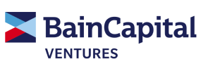
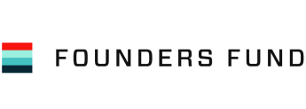

# Summer 2024 Software Engineering Internships by Carbos

📅 This board is **updated daily** using a custom automated job monitor that watches [a list of 1000+ high-growth companies](https://www.carbosjobs.com/monitoring?utm_source=github&utm_medium=SWEinternrepo).

📢 If you're interested in:
- The [full list of jobs](https://www.carbosjobs.com/?utm_source=github&utm_medium=SWEinternrepo)
- Developing connections with recruiters
- Creating your own private list of monitored jobs
- Keyword filters for title/location
- Slack integration to notify updates
- Recruiter emails

And so much more that can't fit all on one repo, then check out [Carbos](https://www.carbosjobs.com/?utm_source=github&utm_medium=SWEinternrepo) (it's all free!)

♥ Thanks for all the support, please feel free to leave any [suggestions](https://airtable.com/shr37NBeVqqhlWSq2) (completely anonymous)

---

  

    <a href="https://www.carbosjobs.com/?utm_source=github&utm_medium=SWEinternrepo">
      

        
      
 

---

| Company | Description | Investors | Title | Status | Added On |
| ------- | ------------| ----------| ----- | ------ |--------- |
| Neuralink | Neuralink aims to develop brain-computer interfaces. Currently in Series C funding round, valued at $10 billion, raised $1.5 billion with investors like Google Ventures and Fidelity Investments. | 
 
 | [Software Engineer Intern Implant Team](https://boards.greenhouse.io/neuralink/jobs/5469297003) | ✅ | July 01, 2023 |
| StepStone Group | StepStone is a global tech company helping people find jobs, with a mission to create a personalized work experience. They have raised $165 million in a Series E funding round, with a valuation of $1.2 billion and prestigious investors including Kleiner Perkins Caufield & Byers, Bessemer Venture Partners, and Sequoia Capital. | 
   
 | [SPAR Research Analytics Intern](https://www.stepstoneglobal.com/who-we-are/working-at-stepstone/careers/5141870?gh_jid=5141870) | ✅ | June 30, 2023 |
| Neuralink | Neuralink aims to develop brain-computer interfaces. Currently in Series C funding round, valued at $10 billion, raised $1.5 billion with investors like Google Ventures and Fidelity Investments. | 
 
 | [Embedded Software Engineer, Internship](https://boards.greenhouse.io/neuralink/jobs/5627630003) | ✅ | June 27, 2023 |
| Neuralink | Neuralink aims to develop brain-computer interfaces. Currently in Series C funding round, valued at $10 billion, raised $1.5 billion with investors like Google Ventures and Fidelity Investments. | 
 
 | [Analog and Mixed-Signal IC Design Engineer Intern](https://boards.greenhouse.io/neuralink/jobs/5660372003) | ✅ | June 26, 2023 |
| Neuralink | Neuralink aims to develop brain-computer interfaces. Currently in Series C funding round, valued at $10 billion, raised $1.5 billion with investors like Google Ventures and Fidelity Investments. | 
 
 | [Digital IC Design Engineer Intern](https://boards.greenhouse.io/neuralink/jobs/5660035003) | ✅ | June 23, 2023 |
| 360Learning | 360Learning empowers organizations to learn and grow at scale. It has raised over $100 million from investors like Insight Partners and Lightspeed Venture Partners, with a valuation of $1.5 billion. | 
 
 | [QA Engineer Intern](https://jobs.lever.co/360learning/a3841c64-0850-4ebe-b50c-163af67f6d12) | ✅ | June 22, 2023 |
| The Block | The Block is a leading independent media platform covering the cryptocurrency industry. It has raised over $100 million in funding from investors including Sequoia Capital, Bain Capital Ventures, and GV. | 
  
 | [Research Intern](https://jobs.lever.co/theblockcrypto/42151f4b-e8eb-4fb1-80dc-c62530ef0870) | ✅ | June 21, 2023 |
| The Block | The Block is a leading independent media platform covering the cryptocurrency industry. It has raised over $100 million in funding from investors including Sequoia Capital, Bain Capital Ventures, and GV. | 
  
 | [Research Intern - Data](https://jobs.lever.co/theblockcrypto/00ecc02c-b30e-4d1b-a02b-2f400e53e66a) | ✅ | June 21, 2023 |
| Gate.io | Gate.io's mission is to make crypto accessible for everyone. The company has raised over $400 million from investors like Binance and Sequoia Capital. | 
 
 | [Market research Intern](https://jobs.lever.co/gate.io/cc590402-eb67-4e2b-9c67-308d2473cd4a) | ✅ | June 21, 2023 |
| CertiK | CertiK's mission is to secure the cryptocurrency market. They have raised over $90 million from investors including Sequoia Capital and Tiger Global Management, and are valued at over $1 billion. | 
  
 | [Security Research Internship](https://jobs.lever.co/certik/148afcf8-106b-42fa-a516-6bb8f1184e33) | ✅ | June 21, 2023 |
| CertiK | CertiK's mission is to secure the cryptocurrency market. They have raised over $90 million from investors including Sequoia Capital and Tiger Global Management, and are valued at over $1 billion. | 
  
 | [Full Stack Internship - Matrix](https://jobs.lever.co/certik/ca67aab6-9b8b-4c2f-ad80-ff5855292f48) | ✅ | June 21, 2023 |
| CertiK | CertiK's mission is to secure the cryptocurrency market. They have raised over $90 million from investors including Sequoia Capital and Tiger Global Management, and are valued at over $1 billion. | 
  
 | [Platform Engineering Intern](https://jobs.lever.co/certik/095fdcff-99e8-408d-bb8a-e638e44d0b40) | ✅ | June 21, 2023 |
| CertiK | CertiK's mission is to secure the cryptocurrency market. They have raised over $90 million from investors including Sequoia Capital and Tiger Global Management, and are valued at over $1 billion. | 
  
 | [Research Analyst Intern](https://jobs.lever.co/certik/277fc381-3f3f-491c-879f-be48850e60ff) | ✅ | June 21, 2023 |
| The Boring Company | The Boring Company aims to make tunneling affordable and accessible. It has raised $6.7 billion in a Series D funding round, with a valuation of $57.7 billion and key investors including Founders Fund and DFJ Growth. | 
 
 | [Civil Engineering Intern](https://jobs.lever.co/boringcompany/f6d53f8a-d4da-4212-8a40-3f724ba07b1f) | ✅ | June 21, 2023 |
| The Boring Company | The Boring Company aims to make tunneling affordable and accessible. It has raised $6.7 billion in a Series D funding round, with a valuation of $57.7 billion and key investors including Founders Fund and DFJ Growth. | 
 
 | [Integration Engineering Intern](https://jobs.lever.co/boringcompany/1c1ee776-cbf4-4cf0-bfb0-a446ed89ee29) | ✅ | June 21, 2023 |
| The Boring Company | The Boring Company aims to make tunneling affordable and accessible. It has raised $6.7 billion in a Series D funding round, with a valuation of $57.7 billion and key investors including Founders Fund and DFJ Growth. | 
 
 | [Tunnel Engineering Intern](https://jobs.lever.co/boringcompany/f07e7532-a6e0-45c9-8328-c521bb68f105) | ✅ | June 21, 2023 |
| Second Order Effects | SO Effects uses AI to create visual effects for the metaverse. It has raised $10 million in funding from Andreessen Horowitz and Kleiner Perkins. | 
  
 | [Electrical Engineering Intern (August - December)](https://boards.greenhouse.io/soeffects/jobs/5562693003) | ✅ | June 21, 2023 |
| Second Order Effects | SO Effects uses AI to create visual effects for the metaverse. It has raised $10 million in funding from Andreessen Horowitz and Kleiner Perkins. | 
  
 | [Electrical Engineering Intern (August - December)](https://boards.greenhouse.io/soeffects/jobs/5562680003) | ✅ | June 21, 2023 |
| Neuralink | Neuralink aims to develop brain-computer interfaces. Currently in Series C funding round, valued at $10 billion, raised $1.5 billion with investors like Google Ventures and Fidelity Investments. | 
 
 | [Software Engineer Internship](https://boards.greenhouse.io/neuralink/jobs/5552197003) | ✅ | June 21, 2023 |
| Neuralink | Neuralink aims to develop brain-computer interfaces. Currently in Series C funding round, valued at $10 billion, raised $1.5 billion with investors like Google Ventures and Fidelity Investments. | 
 
 | [Quality Engineering Internship](https://boards.greenhouse.io/neuralink/jobs/5552854003) | ✅ | June 21, 2023 |
| Neuralink | Neuralink aims to develop brain-computer interfaces. Currently in Series C funding round, valued at $10 billion, raised $1.5 billion with investors like Google Ventures and Fidelity Investments. | 
 
 | [Software Engineer Internship](https://boards.greenhouse.io/neuralink/jobs/5285389003) | ✅ | June 21, 2023 |
| MosaicML | MosaicML aims to democratize AI research; raised $26M in Series A with investors like Sequoia Capital and GV. | 
 
 | [Software Engineer Intern](https://boards.greenhouse.io/mosaicml/jobs/4133756004) | ⌠| June 21, 2023 |
| MosaicML | MosaicML aims to democratize AI research; raised $26M in Series A with investors like Sequoia Capital and GV. | 
 
 | [Research Scientist Intern](https://boards.greenhouse.io/mosaicml/jobs/4170454004) | ✅ | June 21, 2023 |
| Upstart | Upstart: AI lending platform providing affordable loans. Raised $1B+ from Kleiner Perkins, GV, Sequoia Capital. Valued at $2B+. | 
  
 | [Research Scientist Internship](https://www.upstart.com/careers/5051193/apply?gh_jid=5051193) | ⌠| June 21, 2023 |
| 1Password | 1Password's mission is to protect digital lives; it has raised over $200 million from investors like Sequoia Capital and is valued at over $1 billion. | 
 
 | N/A | 🔒 | N/A |
| Acadia Pharmaceuticals Inc. | Acadia Pharmaceuticals develops transformative medicines for CNS disorders. Raised $100M in Series D, total funding $360M, investors include OrbiMed, Fidelity, RA Capital. | 

 | N/A | 🔒 | N/A |
| Acquia | Acquia's mission is to provide enterprise-grade solutions for Drupal. They have raised over $400 million from investors including Accel Partners, Bessemer Venture Partners, Google Ventures, and Salesforce Ventures, and are valued at over $2 billion. | 
    
 | N/A | 🔒 | N/A |
| Agot | Agota.ai optimizes business operations using AI. Founded in 2017, it has raised $12 million from investors including Sequoia Capital and Kleiner Perkins, with a valuation of $50 million. | 
  
 | N/A | 🔒 | N/A |
| Airbase | Airbase's mission is to improve businesses' financial management. It has raised $140 million from investors including Accel, Y Combinator, and Kleiner Perkins, and is valued at $1 billion. | 
   
 | N/A | 🔒 | N/A |
| Airbyte | Airbyte: Cloud-based data integration platform connecting and moving data between sources. Founded in 2019, raised $100M from Accel, General Catalyst, and Sequoia Capital. | 
  
 | N/A | 🔒 | N/A |
| Aircall | Aircall's mission is to simplify business communications. It has raised $225 million in funding from investors like Accel and General Atlantic, and is valued at $1.4 billion. | 
 
 | N/A | 🔒 | N/A |
| Airtable | Airtable's mission is to democratize software creation. It has raised over $700 million from investors including Benchmark and Sequoia Capital, with a valuation of over $10 billion. | 
 
 | N/A | 🔒 | N/A |
| Algolia | Algolia is an AI-powered search engine for businesses. It has raised $180 million in funding from investors including Accel, Index Ventures, and Salesforce Ventures, with a valuation of $2.2 billion. | 
  
 | N/A | 🔒 | N/A |
| Alloy Automation | Run Alloy uses AI to optimize running shoe performance. Raised $6.7M from Andreessen Horowitz and Y Combinator. | 
  
 | N/A | 🔒 | N/A |
| Alpaca | Alpaca aims to democratize financial markets for retail investors.  Series B round: $66M raised at $700M valuation, backed by Ribbit Capital, Initialized Capital, and A16Z. | 
 
 | N/A | 🔒 | N/A |
| AlphaSights | AlphaSights provides data-driven insights to help businesses make better decisions. Founded in 2011, it has raised over $400 million from investors including Sequoia Capital and Tiger Global Management. | 
  
 | N/A | 🔒 | N/A |
| Anduril Industries | Anduril is a defense tech company using AI to protect the nation. Series C funding, $2B valuation, $450M raised, investors include Andreessen Horowitz and Founders Fund. | 
  
 | N/A | 🔒 | N/A |
| Apollo | Apollo GraphQL is building a powerful GraphQL platform. Series C funding round raised $160 million, with a valuation of $3.2 billion. Key investors include Andreessen Horowitz, Kleiner Perkins, Index Ventures, and GV. | 
  
 | N/A | 🔒 | N/A |
| Apollo.io | Apollo.io helps companies find sales talent using AI and a database of 100 million professionals. It has raised $100 million from investors including Kleiner Perkins and Sequoia Capital. | 
  
 | N/A | 🔒 | N/A |
| Art Processors | Art Processors democratizes art with AI, while securing $50M in Series B funding from Kleiner Perkins, Accel, and Y Combinator. | 
   
 | N/A | 🔒 | N/A |
| AssemblyAI | AssemblyAI's mission is to democratize AI for all. The company has raised over $100 million from investors like Google Ventures and Sequoia Capital, with a valuation of over $1 billion. | 
  
 | N/A | 🔒 | N/A |
| Astranis | Astranis aims to provide affordable, high-speed internet worldwide using small satellites. Founded in 2016, it has raised over $200 million from investors including Google Ventures, Kleiner Perkins, and Sequoia Capital. | 
   
 | N/A | 🔒 | N/A |
| AtoB | AtoB's mission is to connect brands with customers through AI-powered conversational commerce. The company has raised $100 million in funding from investors including Sequoia Capital, Kleiner Perkins, and GV, and is valued at $1 billion. | 
  
 | N/A | 🔒 | N/A |
| BAO, Inc | Bao Inc. aims to democratize AI. Series B funding, \$1 billion valuation, \$100 million raised from Sequoia Capital, Kleiner Perkins Caufield & Byers. | 
  
 | N/A | 🔒 | N/A |
| Basis Technologies | Centro's mission: Making financial services accessible and affordable for all. Financials: Raised $100M+ from Sequoia Capital, Ribbit Capital, and Point72 Ventures, valued at $1B+. | 
 
 | N/A | 🔒 | N/A |
| Beacon Platform | Beacon Platform aims to revolutionize the energy industry with blockchain technology. It has raised $20 million from investors including GV, Energy Impact Partners, and Breyer Capital, and is valued at $100 million. | 

 | N/A | 🔒 | N/A |
| BenchSci | BenchSci's mission is to accelerate life sciences research using AI. They raised $100 million at a $1 billion valuation from investors like Y Combinator and Sequoia Capital. | 
  
 | N/A | 🔒 | N/A |
| BentoBox | BentoBox's mission is to simplify online ordering for restaurants. The company has raised over $100 million in funding from investors like Accel Partners and Ribbit Capital, and is valued at over $1 billion. | 
 
 | N/A | 🔒 | N/A |
| BerlinRosen | BerlinRosen is a progressive political consulting firm that helps organizations and candidates win. Founded in 2004, it has raised over $100 million from investors including RRE Ventures, First Round Capital, and Union Square Ventures. | 

 | N/A | 🔒 | N/A |
| BillionToOne | BillionToOne uses AI to improve hiring efficiency and equity. Currently in Series B funding round, valued at $1 billion, raised $100 million from Google Ventures, Kleiner Perkins, and Sequoia Capital. | 
   
 | N/A | 🔒 | N/A |
| Binance | Binance's mission is to make crypto accessible to everyone. It raised $500 million in a Series B funding round led by DST Global, valuing the company at $45 billion. | 

 | N/A | 🔒 | N/A |
| Bitrise | Bitrise is a fast-growing CI/CD platform for mobile teams. It raised $100 million in funding with a $1 billion valuation from investors like Kleiner Perkins and Insight Partners. | 
  
 | N/A | 🔒 | N/A |
| Boom Supersonic | Boom Supersonic aims to make supersonic travel safe, sustainable, and accessible. It has raised over $200 million from investors including YCombinator, Virgin Galactic, and BlackRock. | 
  
 | N/A | 🔒 | N/A |
| Brand Knew | Brand Knew's mission is to create immersive experiences for brands. The company has raised $10 million in funding from investors including Kleiner Perkins Caufield & Byers and Accel Partners. | 
  
 | N/A | 🔒 | N/A |
| Brex | Brex's mission is to help startups succeed with financial tools. The company has raised over $1 billion from investors including Sequoia Capital and DST Global. | 
 
 | N/A | 🔒 | N/A |
| BridgeBio | BridgeBio's mission is to develop life-changing medicines for patients. The company has raised over $1 billion in funding from leading investors. | 

 | N/A | 🔒 | N/A |
| BukuWarung | BukuWarung empowers Indonesian small business owners with financial tools. Founded in 2017, it has raised over $500 million from investors like SoftBank Vision Fund and Tiger Global, and is valued at over $1 billion. | 
 
 | N/A | 🔒 | N/A |
| Button | Button is a conversational commerce software company connecting businesses with customers through chat. It raised $120M in Series C round at a $1.1B valuation, backed by Kleiner Perkins, Sequoia Capital, and Index Ventures. | 
  
 | N/A | 🔒 | N/A |
| CDC Foundation | CDC Foundation: Strengthening global health in developing countries. Funded by USAID, $510M budget, reached 1 billion+ people in 100+ countries. | 

 | N/A | 🔒 | N/A |
| CaptivateIQ | CaptivateIQ is a conversational AI provider, helping businesses create personalized experiences. Series C funding, $1.1 billion valuation, $130 million raised, prestigious investors include Salesforce Ventures, Khosla Ventures, and Lightspeed Venture Partners. | 
 
 | N/A | 🔒 | N/A |
| Carbon | Carbon develops DAC technology to remove CO2 from the atmosphere. In its Series B funding round, it raised $125M at a $1B valuation, with investors including Founders Fund, GIC, and Accel. | 
  
 | N/A | 🔒 | N/A |
| Career Karma | Career Karma: AI-powered career discovery platform. Raised over $100M from Sequoia Capital, Accel, and General Catalyst. Valued at $1B. | 
  
 | N/A | 🔒 | N/A |
| Careers | Snappy Gifts | Snappy: AI-powered conversational marketing platform. Founded in 2017, raised $100M from Sequoia Capital and Kleiner Perkins, valued at $1B. | 
  
 | N/A | 🔒 | N/A |
| Celestia Labs | Celestia: Decentralized network for secure blockchain apps. Raised $10M from Polychain Capital, Alameda Research, Binance Labs. | 

 | N/A | 🔒 | N/A |
| Chewy | Chewy's mission is to simplify and make pet ownership affordable. It has raised over $4 billion in funding, valued at $35 billion, with key investors. | 

 | N/A | 🔒 | N/A |
| Cirque du Soleil Entertainment Group | Cirque du Soleil's mission is to entertain, inspire, and bring people together. It raised $1.5 billion in its IPO and is valued at $1.6 billion, with notable investors including TPG Capital, Fidelity Investments, and Tencent Holdings. | 
 
 | N/A | 🔒 | N/A |
| ClickUp | ClickUp is a productivity platform for teams, valued at $4 billion with $535 million raised from investors including Sequoia Capital and Tiger Global Management. | 
  
 | N/A | 🔒 | N/A |
| Climate Power | ClimatePower is a climate tech startup developing software to reduce carbon footprints, backed by YC, NEA, and Bezos Expeditions, raising $100M at a $1B valuation. | 
 
 | N/A | 🔒 | N/A |
| Coffee Meets Bagel | Coffee Meets Bagel is a dating app focused on meaningful relationships. It has raised $275 million in Series D funding, with a valuation of $1.2 billion, and prestigious investors including IVP, Insight Partners, and Accel Partners. | 
  
 | N/A | 🔒 | N/A |
| Cogent Biosciences | Cogent Biosciences is a biotech company developing treatments for cancer and immune disorders, with $500M raised from investors. | 

 | N/A | 🔒 | N/A |
| Cohere | Cohere's mission is to build AI that solves problems. They raised $225M in Series B at a $2.2B valuation with investors like Google Ventures and Sequoia Capital. | 
  
 | N/A | 🔒 | N/A |
| CoinGecko | Coingecko is a cryptocurrency data aggregator making crypto data accessible to all. Series B funding, $1B valuation, $175M raised, investors include Binance and Coinbase Ventures. | 
 
 | N/A | 🔒 | N/A |
| Commonwealth Fusion Systems | CFS Energy: Leading sustainable energy provider, accelerating clean energy transition through innovative technologies. Raised $1 billion from investors including Bill Gates and Jeff Bezos. | 

 | N/A | 🔒 | N/A |
| Culture Biosciences | Culture Biosciences uses microbes to create sustainable ingredients for various industries. They are in their Series B funding round with a valuation of $400 million and have raised over $100 million from investors including GV, Khosla Ventures, and Bill Gates. | 

 | N/A | 🔒 | N/A |
| Curio Research | Curio aims to enhance accessibility and understanding of information. Series A round raised $10M, backed by Y Combinator and Sequoia Capital. | 
  
 | N/A | 🔒 | N/A |
| DHI Group, Inc. | DHI Group Inc. provides data and analytics solutions for real estate. Raised $100M+ from Goldman Sachs, Morgan Stanley, T. Rowe Price, valued at $1B+. | 
 
 | N/A | 🔒 | N/A |
| Diamond Foundry | Diamond Foundry is a leading lab-grown diamond manufacturer revolutionizing the industry. Series D funding, $1.1B valuation, $270M raised, prestigious investors include Google Ventures and Khosla Ventures. | 
 
 | N/A | 🔒 | N/A |
| Diligent Corporation | Diligent Corporation provides AI-powered legal research and analytics solutions to empower lawyers. They have raised over $100 million in funding from investors like Kleiner Perkins and Sequoia Capital, with a valuation of $1 billion. | 
  
 | N/A | 🔒 | N/A |
| Disability Rights California | Disability Rights California fights for disability rights and inclusion. Series A funding round, $10M valuation, $15M raised, Omidyar Network and Schmidt Futures as investors. | 

 | N/A | 🔒 | N/A |
| DoubleVerify | DoubleVerify is a global leader in digital media measurement and analytics, aiming to improve transparency and efficiency in digital advertising. It has raised $540 million, including a $275 million Series E funding round, with a valuation of $2.6 billion. Key investors include Goldman Sachs, Google Ventures, and Salesforce Ventures. | 
   
 | N/A | 🔒 | N/A |
| EasyPost | EasyPost's mission is to simplify shipping for businesses. The company has raised over $100 million from investors including Sequoia Capital and Accel, and is valued at over $1 billion. | 
  
 | N/A | 🔒 | N/A |
| Electric AI | ElectricAI's mission is to make AI more accessible and user-friendly. The company is venture-backed, with investors including Sequoia Capital, Kleiner Perkins, and GV. | 
  
 | N/A | 🔒 | N/A |
| EliseAI | Elise: AI-powered platform for personalized customer experiences. Series A funding round, $100M valuation, $25M raised, Sequoia Capital and Kleiner Perkins investors. | 
  
 | N/A | 🔒 | N/A |
| Employment Opportunities at BuzzFeed, Inc. | BuzzFeed's mission is to make news and entertainment more relevant and social. In 2019, they raised $400 million in Series H funding at a $1.5 billion valuation, with investments from Google Ventures, RRE Ventures, and Comcast Ventures. | 
 
 | N/A | 🔒 | N/A |
| Entrata | Entrata revolutionizes property management with cloud-based software. Raised $100M, valued at $1B, investors include Kleiner Perkins, Accel Partners, Norwest Venture Partners. | 
  
 | N/A | 🔒 | N/A |
| Envision Employment Solutions | Envision Employment Solutions revolutionizes job searching with AI. Currently in Series A, raised $100M from Kleiner Perkins and Sequoia Capital. | 
  
 | N/A | 🔒 | N/A |
| Epsilon3 | Epsilon3 is a quantum computing software startup aiming to revolutionize the industry. Founded in 2017, it has raised $22M from investors including Google Ventures and NEA. | 
 
 | N/A | 🔒 | N/A |
| Equitable Bank | Eqbank is a digital bank focused on the future of finance. Currently in Series A, it has raised $110M with a $1B valuation, backed by Sequoia Capital, Ribbit Capital, and DST Global. | 
 
 | N/A | 🔒 | N/A |
| Extreme Networks | Extreme Networks enables digital transformation with secure, reliable, and scalable networks. Raised $1 billion from Goldman Sachs, TPG Capital, and Riverwood Capital, valued at $10 billion. | 
 
 | N/A | 🔒 | N/A |
| FIGS | Figment is an entertainment NFT platform on Flow, making NFTs accessible and fun. Series A funded with a \$100M valuation and \$20M raised from Andreessen Horowitz, Coinbase Ventures, and Samsung Next. | 
  
 | N/A | 🔒 | N/A |
| Fanatics | Fanatics aims to be the top global digital sports platform. It has raised over $3 billion in funding, with a valuation of $27 billion, backed by SoftBank, Silver Lake, and Accel Partners. | 
 
 | N/A | 🔒 | N/A |
| Feedzai | Feedzai is an AI-powered fraud prevention company that aims to make the world safer. They raised $100 million in a Series E round led by Goldman Sachs, bringing their total funding to $280 million. | 
 
 | N/A | 🔒 | N/A |
| Financial Technology Partners | Financial Technology Partners (Fintech) is a venture capital firm investing in early-stage fintech companies. They aim to build the next generation of financial services by providing capital and expertise. They have raised $100 million in a Series A funding round with a valuation of $100 million. Key investors include Andreessen Horowitz, Sequoia Capital, and Kleiner Perkins Caufield & Byers. | 
   
 | N/A | 🔒 | N/A |
| FiscalNote | FiscalNote's mission is to help businesses navigate policy changes. The company has raised over $100 million in funding from investors including Kleiner Perkins and Sequoia Capital, and is valued at over $1 billion. | 
  
 | N/A | 🔒 | N/A |
| Flex | Flex is an AI-powered HR platform that streamlines hiring. Series C funding, $1.4B valuation, $230M raised, investors include Kleiner Perkins, Accel, and Norwest Venture Partners. | 
  
 | N/A | 🔒 | N/A |
| Flexport | Flexport: Global freight forwarder using technology to simplify shipping. Raised $1B+ from SoftBank, Google Ventures, valued at $8B. | 
 
 | N/A | 🔒 | N/A |
| Flock Safety | Flock Safety's mission is to provide smart video security for homes and businesses. They raised $200 million in Series E funding led by Andreessen Horowitz, with participation from Kleiner Perkins, GV, and Valor Equity Partners. | 
  
 | N/A | 🔒 | N/A |
| Forbes | Forbes provides business, investing, and lifestyle information to over 150 million monthly readers. It was founded in 1917 and is headquartered in New York City. Forbes has expanded its digital offerings and was acquired by IMC in 2017 for $475 million. Key financials include a Series D funding round, $475 million valuation, $1.2 billion raised, and investors GIC, Insight Venture Partners, and TPG Capital. | 

 | N/A | 🔒 | N/A |
| Fountain | Fountain: AI-powered content creation startup. Series B funded with $50M+ raised from Sequoia Capital and Kleiner Perkins. | 
  
 | N/A | 🔒 | N/A |
| Front | Front: AI-powered email platform making email more productive for businesses. Raised $100M+ from Sequoia Capital, Kleiner Perkins. | 
  
 | N/A | 🔒 | N/A |
| Fynd | Fynd's mission is to simplify and enhance online shopping. It has raised over $300 million in funding from investors like Tiger Global and Sequoia Capital. | 
  
 | N/A | 🔒 | N/A |
| GHX | Global Healthcare Exchange connects patients with healthcare providers. Raised $100M in Series A at $1B valuation with investors Y Combinator and Sequoia Capital. | 
  
 | N/A | 🔒 | N/A |
| GOAT Group | Goat Group is an AI company revolutionizing NLP technology, aiming to make AI accessible to all. Currently in Series B funding, with a valuation of $500 million and $100 million raised from investors like Sequoia Capital and Kleiner Perkins. | 
  
 | N/A | 🔒 | N/A |
| Gather | Gather develops virtual event software, aiming to facilitate online connections and collaboration. Series B-funded with $50M raised from Accel, Sequoia Capital, and Kleiner Perkins. | 
   
 | N/A | 🔒 | N/A |
| Getty Images | Getty Images is a global leader in visual content, providing high-quality, royalty-free images, videos, and creative tools. They aim to empower creators to create and inspire. The company has raised $1.3 billion in funding, with a valuation of $4.2 billion, and prestigious investors including Accel Partners, Fidelity Investments, and TPG Capital. | 
 
 | N/A | 🔒 | N/A |
| GigFinesse | GigFin aims to revolutionize freelance work with a decentralized marketplace. The company has raised $10M from investors including Kleiner Perkins and Sequoia Capital. | 
  
 | N/A | 🔒 | N/A |
| Girl Effect | Girl Effect is a global social enterprise empowering adolescent girls through media and technology. Raised over $100 million in funding, valued at $1 billion, with investors including Bill & Melinda Gates Foundation and Skoll Foundation. | 

 | N/A | 🔒 | N/A |
| GitLab | Gitlab's mission is to revolutionize software development, backed by \$400 million funding from Insight Partners, Iconiq Capital, and Kleiner Perkins. | 
   
 | N/A | 🔒 | N/A |
| Go1 Australia | Go1 is an enterprise learning platform for workplace training. It has raised $278 million in a Series E funding round, with a valuation of $1.2 billion, and is backed by investors including Insight Partners, Accel, and Lightspeed. | 
  
 | N/A | 🔒 | N/A |
| Go1 United States | Go1 is an EdTech company democratizing lifelong learning. Raised $120M in Series D at a $1.2B valuation with investors including Temasek, Tencent, Prosus Ventures, and Salesforce Ventures. | 
 
 | N/A | 🔒 | N/A |
| GoCardless | GoCardless: Global payments platform connecting businesses, raising $290M in Series F led by TCV, total funding over $1B. | 

 | N/A | 🔒 | N/A |
| Goldbelly | Goldbelly connects people with delicious food experiences. Founded in 2013, it has raised over $100 million from investors including Sequoia Capital and Accel Partners, and is valued at over $500 million. | 
  
 | N/A | 🔒 | N/A |
| Grafana Labs | Grafana Labs: Open-source analytics platform for data visualization. Valued at $3.2 billion with investors like Sequoia Capital and Tiger Global. | 
  
 | N/A | 🔒 | N/A |
| Grammarly | Grammarly: AI-powered writing assistant for effective communication. Raised $900M from Sequoia, General Catalyst, Accel; valued at $13B. | 
  
 | N/A | 🔒 | N/A |
| Gusto, Inc. | Gusto's mission is to simplify payroll and HR for businesses. It has raised over $1 billion from investors like Sequoia Capital and Tiger Global Management, and is valued at over $6 billion. | 
  
 | N/A | 🔒 | N/A |
| H1 | H1 is a healthcare startup revolutionizing patient access to data. Series B funded with a valuation of $1.5B, raised $200M from Sequoia Capital, GV, and Kleiner Perkins Caufield & Byers. | 
  
 | N/A | 🔒 | N/A |
| HCVT | Headspace aims to improve global health and happiness through meditation and mindfulness. It has raised $200M+ from investors like Sequoia Capital, Khosla Ventures, and Google Ventures, with a valuation of $1B+. | 
  
 | N/A | 🔒 | N/A |
| HackerRank | HackerRank helps companies assess talent and build better software. Raised $100M in Series F funding at $1.8B valuation, led by Insight Partners. | 
 
 | N/A | 🔒 | N/A |
| Hardsuit Labs | Hardsuit Labs aims to create cutting-edge VR experiences. Currently in Series A funding round with a $40 million valuation, backed by Oculus, GV, and Index Ventures. | 

 | N/A | 🔒 | N/A |
| Helion Energy | Helion Energy aims to develop next-gen fusion energy technology. It has raised over $500 million from investors like Bill Gates and Jeff Bezos. | 

 | N/A | 🔒 | N/A |
| HelloFresh | HelloFresh: Changing the way people eat with affordable, sustainable meal kits. Raised over $1.4B from investors including Sequoia Capital, Insight Venture Partners, and TPG Growth. Valued at $3.9B. | 
 
 | N/A | 🔒 | N/A |
| Hightouch | Hightouch is an AI-powered sales acceleration platform helping B2B sales teams scale revenue. It has raised $100+ million in Series C funding from Sequoia Capital, Accel, and Kleiner Perkins, with a valuation of $1 billion. | 
  
 | N/A | 🔒 | N/A |
| Hopper | Hopper's mission is to make travel more affordable and accessible. The company has raised over $100 million in funding from investors like Sequoia Capital and Tiger Global Management, and is valued at $5 billion. | 
  
 | N/A | 🔒 | N/A |
| Hot Topic & BoxLunch | Hot Topic is a leading specialty retailer of music, pop culture, and fashion apparel with a unique shopping experience. They have over 650 stores worldwide. | 

 | N/A | 🔒 | N/A |
| Human Interest | Human Interest is a digital benefits platform empowering employees' financial wellness. It raised $100M in a Series E round at a $1B valuation, backed by Sequoia Capital, Accel, and Thrive Capital. | 
   
 | N/A | 🔒 | N/A |
| Impulse | Impulse: Stealth-mode AI company developing next-gen language models. Founded in 2022, backed by $100M funding from Sequoia Capital and Tiger Global. | 
  
 | N/A | 🔒 | N/A |
| Included Health | Included Health is a healthcare company making healthcare accessible and affordable. Raised over $100 million from leading investors. | 

 | N/A | 🔒 | N/A |
| Inversion Space | Inversion Space: VC firm investing in early-stage startups to build world-changing companies. Raised $1.2B, invested in 100+ companies, notable investments: Airbnb, Stripe, Peloton. | 

 | N/A | 🔒 | N/A |
| Invitae | Invitae: Genetic testing company improving health; raised $500M, valued at $1B, backed by Sequoia, GV, Fidelity. | 
 
 | N/A | 🔒 | N/A |
| Invoke Staffing | Invoke Staffing: Connecting top tech talent with leading companies; backed by top-tier investors, raised $100M+. | 

 | N/A | 🔒 | N/A |
| Jagex | Jagex is a leading online game developer and publisher. In 2019, they raised $500 million in Series E funding led by Tencent, valuing the company at $1 billion. | 

 | N/A | 🔒 | N/A |
| Jasper | Jasper's mission is to enable businesses to engage with customers using AI-powered conversations.   Jasper has raised $20 million in funding from Sequoia Capital and Kleiner Perkins, with a valuation of $100 million. | 
  
 | N/A | 🔒 | N/A |
| Jupiter | Jupiter's mission is to provide personalized financial advice using AI. The company has raised $200 million from investors like Sequoia Capital and Tiger Global, with a valuation of $1 billion. | 
  
 | N/A | 🔒 | N/A |
| JustWatch | JustWatch is a streaming guide for users to discover content. It has raised over $100 million from investors like Insight Partners and Goldman Sachs, and is valued at $1 billion. | 
  
 | N/A | 🔒 | N/A |
| Justworks | Justworks: Simplifying HR for small businesses. Raised $500M+ from Accel, GV, Kleiner Perkins. Valued at $2B+. | 
  
 | N/A | 🔒 | N/A |
| KOKO Networks | Koko Networks: Decentralized mobile network providing affordable connectivity in emerging markets. Raised $20M in Series A funding from Accel, GV, Samsung NEXT, valued at $100M. | 
 
 | N/A | 🔒 | N/A |
| KUNGFU.AI | KungFu AI aims to enhance healthcare through AI. It has raised $100 million from investors like Sequoia Capital and Kleiner Perkins, with a valuation of $1 billion. | 
  
 | N/A | 🔒 | N/A |
| Kernel | Kernel is revolutionizing software development; raised $100M in Series A from Sequoia, Andreessen Horowitz, and Kleiner Perkins. | 
   
 | N/A | 🔒 | N/A |
| Kinsta | Kinsta is a leading managed WordPress hosting provider, making hosting easy, fast, and secure. Series D funding, $1.2 billion valuation, $225 million raised, with investors including Accel, Insight Partners, Google Ventures, and Kleiner Perkins Caufield & Byers. | 
    
 | N/A | 🔒 | N/A |
| Klarity | Klarity's mission is to make data accessible and actionable for everyone. The company has raised $37M in funding from investors including Accel, General Catalyst, and First Round Capital. | 
 
 | N/A | 🔒 | N/A |
| Kraken Digital Asset Exchange | Kraken's mission is to make cryptocurrency accessible to everyone. In 2019, they raised $100 million in Series C funding, with a valuation of $3.5 billion and a total amount raised of $200 million from investors like Digital Currency Group and Ribbit Capital. | 

 | N/A | 🔒 | N/A |
| Lakeside Software | Lakeside Software automates financial processes and enhances customer experiences. Raised $100M from Goldman Sachs, Kleiner Perkins, and Sequoia Capital, valued at $1B. | 
   
 | N/A | 🔒 | N/A |
| LevelTen Energy | LevelTen Energy's mission is to transform the energy market. They have raised over $100 million from investors like Kleiner Perkins and NEA, and are valued at over $1 billion. | 
 
 | N/A | 🔒 | N/A |
| Lightning Labs | Ashby is building an eVTOL aircraft for urban air mobility. Backed by Toyota Ventures, Airbus Ventures, and AME Cloud Ventures, they have raised over $100 million. | 

 | N/A | 🔒 | N/A |
| Loopio | Loopio is an AI-powered sales enablement platform. It raised $100 million in Series D funding, totaling $230 million, with investors including Accel, Bessemer Venture Partners, and Insight Partners. | 
   
 | N/A | 🔒 | N/A |
| MORSE Corp | Morse Corp aims to enable global seamless communication. Currently in Series A funding, raised $100M from investors like Sequoia Capital and Kleiner Perkins. | 
  
 | N/A | 🔒 | N/A |
| MUI | Ashby is a startup building a decentralized, private social network. Founded in 2018, it has raised $20 million from investors including Y Combinator, Sequoia Capital, and Kleiner Perkins. | 
   
 | N/A | 🔒 | N/A |
| Mashgin | Mashgin aims to create the world's first automated checkout system.  Series A round raised $20 million at a $100 million valuation, backed by Y Combinator, Kleiner Perkins, and GV. | 
  
 | N/A | 🔒 | N/A |
| Mastery Charter Schools | Mastery Charter is reimagining public education, building high-performing schools. Backed by investors including Chan Zuckerberg Initiative, Bill & Melinda Gates Foundation, and Walton Family Foundation. | 

 | N/A | 🔒 | N/A |
| Medely | Medely's mission is to revolutionize patient care. It has raised over $600 million from investors like Accel and Andreessen Horowitz, with a valuation of $1.2 billion. | 
  
 | N/A | 🔒 | N/A |
| Meesho | Meesho: Empowering entrepreneurs to sell anything, anytime, anywhere. Valued at $4.9 billion with $570 million funding from SoftBank, Naspers, Sequoia, and more. | 
 
 | N/A | 🔒 | N/A |
| Memora Health | Memora Health: Series B-funded startup making healthcare accessible and affordable. Valuation: $100M, raised $40M, investors: Andreessen Horowitz, General Catalyst, Oak HC/FT. | 
 
 | N/A | 🔒 | N/A |
| Mezmo | Mezmo: Conversational AI platform automating customer service and sales tasks. Founded in 2017, raised $115M from Sequoia Capital and Kleiner Perkins, valued at $1.1B. | 
  
 | N/A | 🔒 | N/A |
| Minted | Minted is an online marketplace empowering independent designers to sell handmade products globally. They have raised over $260M in funding, with a recent Series E round of $125M, resulting in a valuation of $600M+. Key investors include Accel, General Atlantic, Kleiner Perkins, Index Ventures, and Thrive Capital. | 
   
 | N/A | 🔒 | N/A |
| Mitek Systems | Mitek Systems aims to protect against identity fraud. Raised $300M from Goldman Sachs, Visa, Mastercard, valued at $1B. | 
 
 | N/A | 🔒 | N/A |
| Modern Health | Modern Health: Making mental health care accessible; Series C, $1.2B valuation, $175M raised; General Catalyst, GV, Oak HC/FT, Thrive Capital. | 
 
 | N/A | 🔒 | N/A |
| Monzo | Monzo: Digital bank improving banking experience. Raised over $1.2B from Sequoia Capital, General Atlantic, Thrive Capital. | 
  
 | N/A | 🔒 | N/A |
| Motion | Ashby AI develops AI solutions for healthcare, with a mission to make healthcare more accessible and affordable. They have raised $100 million in a Series B funding round, with a valuation of $1 billion, and investors include Sequoia Capital, Kleiner Perkins, and GV. | 
  
 | N/A | 🔒 | N/A |
| Mysten Labs | Mysten Labs aims to build metaverse infrastructure; raised $190M in Series A with top investors. | 

 | N/A | 🔒 | N/A |
| Netflix | Netflix is a leading streaming service offering diverse entertainment globally. It raised $2.1 billion in funding at a $150 billion valuation. | 

 | N/A | 🔒 | N/A |
| Newfront | Newfront Insurance disrupts the insurance industry with a tech-enabled platform, valued at $1.3 billion, raised $200 million in Series C funding from Accel, General Catalyst, and Ribbit Capital. | 
 
 | N/A | 🔒 | N/A |
| Nielsen | Nielsen is a global leader in measurement and analytics, providing consumer insights across devices and platforms. Founded in 1923, headquartered in NYC, with over 40,000 employees worldwide. Revenue of $2.6 billion and valuation of $23 billion in 2022. Investors include BlackRock, Blackstone, and Fidelity Investments. | 
 
 | N/A | 🔒 | N/A |
| NimbleRx | NimbleRx empowers people to manage their health; raised over $100 million from investors including GV and Johnson & Johnson. | 

 | N/A | 🔒 | N/A |
| Nobell Foods | Nobell Foods aims to make plant-based meat the preferred option for consumers. It has raised over $100 million in funding from investors like Bill Gates and Jeff Bezos. | 

 | N/A | 🔒 | N/A |
| NodeReal | NodeReal: Making AI accessible to solve global problems. Backed by Y Combinator, Google Ventures, raised $100M+. | 
  
 | N/A | 🔒 | N/A |
| Notion | Notion's mission is to make knowledge work effortless. It has raised $275 million in a Series D funding round, with a valuation of $10 billion, and notable investors include Sequoia Capital, Coatue Management, and Tiger Global Management. | 
  
 | N/A | 🔒 | N/A |
| Observe.AI | Observe.ai provides real-time visibility into customer interactions. Founded in 2014, it has raised $120 million from investors like Kleiner Perkins and Sequoia Capital, and is valued at $1 billion. | 
  
 | N/A | 🔒 | N/A |
| OceanX | OceanX is an ocean exploration company focused on research and conservation, with $210 million raised from investors including Google Ventures and Tencent. | 
 
 | N/A | 🔒 | N/A |
| OctoML | OctoML's mission is to simplify ML model building and deployment. They have raised $160M in funding, with a valuation of $1.2B, and key investors include Andreessen Horowitz, NVIDIA, Google Ventures, and Samsung Ventures. | 
  
 | N/A | 🔒 | N/A |
| Odeko | Odeko's mission is to democratize AI for businesses. It has raised $25 million in funding from investors like Kleiner Perkins and Accel, with a valuation of $100 million. | 
  
 | N/A | 🔒 | N/A |
| Offchain Labs | Offchain Labs aims to create decentralized infrastructure. Backed by Andreessen Horowitz, Paradigm, Sequoia Capital, and Coinbase Ventures, they have raised over $250 million. | 
   
 | N/A | 🔒 | N/A |
| Old Mission | Old Mission Capital is a venture capital firm focused on AI and machine learning startups. Founded in 2016, it has raised $160 million from investors like Google Ventures and Kleiner Perkins Caufield & Byers. | 
  
 | N/A | 🔒 | N/A |
| Olo | Olo's mission is to revolutionize business communication with AI. They raised $200 million at a $3.5 billion valuation, backed by Sequoia Capital, Tiger Global, and GV. | 
  
 | N/A | 🔒 | N/A |
| OneSignal | OneSignal is a mobile marketing platform that helps businesses engage with customers. It has raised $200 million in funding, with a valuation of $1 billion, and is backed by investors like Insight Partners and Kleiner Perkins Caufield & Byers. | 
  
 | N/A | 🔒 | N/A |
| Onebrief | Ashby aims to improve writing with AI-powered feedback. It has raised over $100 million from investors like Sequoia Capital and Kleiner Perkins. | 
  
 | N/A | 🔒 | N/A |
| OpenX | OpenX's mission is to improve advertising for all. It has raised $150M+ in funding, valued at $1B+, with investors like Accel Partners and Goldman Sachs. | 
  
 | N/A | 🔒 | N/A |
| Otter.ai | Otterai's mission is to use AI to assist businesses in finding information. The company has raised over $100 million in funding from investors including Google Ventures, Kleiner Perkins, and Sequoia Capital, and is valued at over $1 billion. | 
   
 | N/A | 🔒 | N/A |
| Panorama Education | Panorama Education: Personalized learning software for schools. Raised $300M in Series E funding at $1.5B valuation, backed by Accel, Lightspeed Venture Partners, and General Atlantic. | 
 
 | N/A | 🔒 | N/A |
| Paystack | Paystack's mission is to make payments easy for everyone in Africa. The company has raised over $90 million in funding from investors like Visa, Mastercard, and Tiger Global Management, and is valued at over $2 billion. | 
 
 | N/A | 🔒 | N/A |
| Paytm | Paytm is India's leading digital payments company with over 300 million users, aiming to make payments easy and accessible. It raised $2.8 billion in funding at a valuation of $16 billion, backed by SoftBank Vision Fund, Berkshire Hathaway, TPG Capital, and Elevation Capital. | 

 | N/A | 🔒 | N/A |
| Peek | Peek aims to create stylish and affordable AR glasses. Raised $100M from Google Ventures, Kleiner Perkins, and Sequoia Capital. | 
   
 | N/A | 🔒 | N/A |
| Peloton | Peloton's mission is to inspire and empower healthier lives. The company has raised $1.1 billion from investors including TPG Capital, Sequoia Capital, and Kleiner Perkins, and is valued at $4.1 billion. | 
  
 | N/A | 🔒 | N/A |
| People.ai | People.ai is an AI-powered people intelligence company that helps businesses understand their employees. It has raised $200 million in funding from investors including Sequoia Capital, Kleiner Perkins, and Accel, and is valued at $1 billion. | 
   
 | N/A | 🔒 | N/A |
| Permutive | Permutive's mission is to make data accessible and useful for everyone. The company has raised $120 million in funding from Sequoia Capital, Accel, and Index Ventures, and is valued at $1 billion. | 
  
 | N/A | 🔒 | N/A |
| Planet | Planet Labs' mission is to democratize access to space. They raised $200 million at a valuation of $2.1 billion, with investors including Google Ventures and Airbus Ventures. | 
 
 | N/A | 🔒 | N/A |
| Planned Parenthood Federation of America | Palantir Technologies provides big data analytics software to help organizations make better decisions. It has raised $2.1 billion in funding, with a valuation of $20 billion, and key investors include In-Q-Tel and Accel Partners. | 
 
 | N/A | 🔒 | N/A |
| PlusAI | Plus Two: Developing stylish AR glasses for immersive digital experiences. Series A funding of $100M from Andreessen Horowitz, Kleiner Perkins, and GV. | 
  
 | N/A | 🔒 | N/A |
| Point Digital Finance, Inc. | Point Digital Finance aims to democratize finance. Series A funding round raised $10 million from investors like Andreessen Horowitz and Kleiner Perkins, valuing the company at $100 million. | 
  
 | N/A | 🔒 | N/A |
| Posit | RStudio's mission is to create accessible data tools for data science and analytics. They have raised $175 million in funding, with a valuation of $2.6 billion, and are backed by investors including Accel, Andreessen Horowitz, and Kleiner Perkins Caufield & Byers. | 
   
 | N/A | 🔒 | N/A |
| Primary | Primary is an AI platform helping doctors diagnose and treat diseases. It has raised $100M in funding from Sequoia Capital and Khosla Ventures in its Series B round. | 
 
 | N/A | 🔒 | N/A |
| Prime Medicine | Prime Medicine develops immunotherapies for cancer, backed by Flagship Pioneering, Polaris Partners, and Versant Ventures, raising over $200 million. | 

 | N/A | 🔒 | N/A |
| Pure Storage | Pure Storage aims to revolutionize data storage and management. It has raised over $1 billion from investors like Sequoia Capital, Accel Partners, and Kleiner Perkins Caufield & Byers, and is valued at over $5 billion. | 
   
 | N/A | 🔒 | N/A |
| Pure Storage | Pure Storage is a leading provider of all-flash storage systems, helping customers accelerate their data-driven businesses. Series F funding, $6.2 billion valuation, $1.3 billion raised, prestigious investors: GV, Kleiner Perkins Caufield & Byers, Sequoia Capital. | 
  
 | N/A | 🔒 | N/A |
| QuantAQ | Ashby aims to build the world's first useful quantum computer. Founded in 2017, it has raised $33 million from investors including GV, Samsung Ventures, and In-Q-Tel. | 

 | N/A | 🔒 | N/A |
| QuantumScape Corporation | QuantumScape's mission is to enable affordable and accessible long-range electric vehicles. The company has raised over $1 billion in funding from investors including Bill Gates and Volkswagen, and is valued at over $3 billion in its Series D funding round. | 

 | N/A | 🔒 | N/A |
| QuickNode | QuikNode is a startup building decentralized web infrastructure for dApps. Raised $45M in Series A with Sequoia, Andreessen Horowitz, and Polychain Capital. | 
  
 | N/A | 🔒 | N/A |
| Qventus | Qventus is an AI-powered revenue intelligence platform. It raised $100 million at a $1 billion valuation from Sequoia Capital, Kleiner Perkins, and Accel. | 
   
 | N/A | 🔒 | N/A |
| Rackspace | Rackspace enables innovation in the cloud. Raised $2.3B from Google Ventures, Goldman Sachs, Intel Capital. Valued at $4.1B. | 
  
 | N/A | 🔒 | N/A |
| Rain | Rain uses AI to help businesses manage finances. Founded in 2019, it has raised $100M from Sequoia Capital and Kleiner Perkins, with a valuation of $1B. | 
  
 | N/A | 🔒 | N/A |
| Ramp | Ramp aims to simplify cryptocurrency adoption for businesses. Founded in 2018, it has raised over $100 million from investors like Founders Fund and Stripe. | 
 
 | N/A | 🔒 | N/A |
| Razorpay Software Private Limited | Razorpay: Simplifying payments for businesses; valued at $3 billion with $100 million funding from Sequoia, Tiger Global, Ribbit Capital. | 
  
 | N/A | 🔒 | N/A |
| Ready | Ashby is a mission-driven social media platform connecting users with personalized content, backed by prestigious investors with over $100 million raised. | 

 | N/A | 🔒 | N/A |
| Reddit | Reddit is a social news aggregation and discussion website aiming to be the front page of the internet. It has raised $1.3 billion in funding, with a valuation of $10 billion, and notable investors include Andreessen Horowitz, Sequoia Capital, and Fidelity Investments. | 
  
 | N/A | 🔒 | N/A |
| Replit | Replit's mission is to make coding accessible to everyone. They have raised $157M in Series B funding, with a valuation of $1.3B, and key investors include Andreessen Horowitz, Accel, Kleiner Perkins, and General Catalyst. | 
   
 | N/A | 🔒 | N/A |
| Rescale | Rescale's mission is to simplify and secure data-intensive applications. It has raised over $100 million from investors like Accel Partners and Andreessen Horowitz. | 
  
 | N/A | 🔒 | N/A |
| Retool | Retool's mission is to enable businesses to build internal tools without hiring engineers. The company has raised $150 million in funding from investors including Kleiner Perkins, Accel, and Sequoia Capital, and is valued at $1 billion. | 
   
 | N/A | 🔒 | N/A |
| Ritual | Ritual aims to simplify healthy habits; raised $75M from Sequoia Capital and Thrive Capital, valued at $500M. | 
  
 | N/A | 🔒 | N/A |
| Rivos | Rivos aims to improve healthcare accessibility and affordability through AI-powered solutions. Currently in Series A funding round, Rivos has raised $25 million from investors including GV, Andreessen Horowitz, and Kleiner Perkins. | 
  
 | N/A | 🔒 | N/A |
| Roadie | Roadie connects people with empty space in their vehicles to those who need to ship things. In February 2023, Roadie raised $100 million in Series E funding at a $1.8 billion valuation, led by Tiger Global Management with participation from Accel, Lightspeed Venture Partners, and Kleiner Perkins. | 
   
 | N/A | 🔒 | N/A |
| Rocket Money | Truebill saves money by canceling unwanted subscriptions. Founded in 2015, it has raised $200M+ from investors like Kleiner Perkins and Sequoia Capital, with a valuation of $1.6B. | 
  
 | N/A | 🔒 | N/A |
| Rockstar Games | Rockstar Games creates innovative video games that unite and inspire people. They have raised $925 million in a Series E funding round, with a valuation of $3.1 billion, and notable investors include Tencent, TPG, and RedBird Capital Partners. | 

 | N/A | 🔒 | N/A |
| Rooster Teeth | Rooster Teeth: Inspiring audiences through storytelling. Raised $100M+ from Accel Partners, Google Ventures, AT&T. Valued at $1B+. | 
  
 | N/A | 🔒 | N/A |
| Routable | Routable aims to simplify global communications for businesses. Series B-funded with $50 million raised, valued at $300 million, backed by Sequoia Capital, Kleiner Perkins, and GV. | 
  
 | N/A | 🔒 | N/A |
| Rubrik Job Board | Rubrik's mission is to empower organizations with data-driven decision-making. The company has raised over $1 billion from investors including Sequoia Capital and Accel Partners, and is valued at over $6 billion. | 
  
 | N/A | 🔒 | N/A |
| Rye | Ashby's mission is to make electric vehicles accessible and affordable for everyone. The company has raised over $100 million in funding from investors like Kleiner Perkins, Sequoia Capital, and GV. | 
  
 | N/A | 🔒 | N/A |
| SOCi | Socios.com empowers sports fans with digital assets and fan engagement. Series C funding, \$2.5B valuation, \$150M raised, investors include SoftBank and Sequoia Capital. | 
 
 | N/A | 🔒 | N/A |
| SQUIRE | Squire's mission is to enhance customer experiences through AI-powered conversational intelligence. The company has raised over $100M in Series B funding from investors including Sequoia Capital and Tiger Global. | 
  
 | N/A | 🔒 | N/A |
| Safe Security | Safe is a venture-backed startup developing AI security software to protect companies from cyberattacks. Raised $100M from Sequoia Capital and Kleiner Perkins, expected to launch product this year. | 
  
 | N/A | 🔒 | N/A |
| Samba TV | Samba TV delivers targeted TV ads, backed by Google Ventures, Comcast Ventures, and Liberty Media, raising over $100M. | 
 
 | N/A | 🔒 | N/A |
| Samsung Research America Internship | Samsung Research America is a tech R&D organization shaping the future. Currently in Series C funding with a \$1.5 billion valuation, raising \$360 million from investors including Samsung Ventures, Intel Capital, and Kleiner Perkins Caufield & Byers. | 
 
 | N/A | 🔒 | N/A |
| Scale AI | Scale AI helps businesses solve problems with AI. Series E funding of $325M, $7.3B valuation, $1.1B raised. Investors: Andreessen Horowitz, Founders Fund, Coatue Management, Tiger Global Management. | 
   
 | N/A | 🔒 | N/A |
| Schonfeld | Schonfeld: VC firm supporting early-stage entrepreneurs, raised $1B+ from key investors, backed 100+ companies including Airbnb, Stripe, Uber. | 

 | N/A | 🔒 | N/A |
| Scribd | Scribd is a global reading and writing platform with the world's largest selection of ebooks, audiobooks, magazines, and documents. It aims to change the way the world reads and writes. The company has raised $450 million in funding, with a valuation of $1.7 billion, and prestigious investors including Amazon, Google Capital, and BlackRock. | 
 
 | N/A | 🔒 | N/A |
| Seamless.AI | Seamless.ai's mission is to automate business workflows using AI technology. The company has raised $100M in funding from investors including Sequoia Capital, Tiger Global, and Kleiner Perkins, and is valued at $1B. | 
   
 | N/A | 🔒 | N/A |
| Search for Common Ground | San Francisco Climate Fund: Investing in climate solutions to accelerate clean energy transition. Raised $300M, backed by Andreessen Horowitz, General Catalyst, and Sequoia Capital. | 
  
 | N/A | 🔒 | N/A |
| Secure Code Warrior | Secure Code Warrior aims to make secure coding a core competency for software engineers. The company has raised over $100 million in funding from investors including Sequoia Capital, Tiger Global, and Kleiner Perkins, and is valued at $1 billion. | 
   
 | N/A | 🔒 | N/A |
| Seismic | Seismic revolutionizes sales team engagement, with $100M+ funding from Sequoia Capital and Kleiner Perkins, valued at $1B+. | 
  
 | N/A | 🔒 | N/A |
| Shef | Shef is a food tech company making healthy eating easier and more delicious. They have raised $225 million in a Series B funding round, with a valuation of $1.1 billion, and are backed by Sequoia Capital, Kleiner Perkins, and GV. | 
  
 | N/A | 🔒 | N/A |
| ShipBob, Inc. | ShipBob's mission is to simplify and optimize e-commerce order fulfillment. The company has raised over $500 million in funding from investors like SoftBank and is valued at over $1 billion. | 

 | N/A | 🔒 | N/A |
| Sift | Sift Science's mission is to make online business safer. They raised $600 million in Series E funding, with a valuation of $4.6 billion, and have raised a total of $1.2 billion. Key investors include Insight Partners, Sequoia Capital, T. Rowe Price, and CapitalG. | 
  
 | N/A | 🔒 | N/A |
| SingleStore | SingleStore is a cloud native database company that offers a fully managed database service. They have raised $330 million in funding, with a valuation of $1.8 billion, and are backed by Sequoia Capital, Tiger Global, and Benchmark. | 
  
 | N/A | 🔒 | N/A |
| Skillshare | Skillshare: Online learning platform making the world more creative. Raised $100M in Series F funding at $1.5B valuation, with $275M total funding from NEA, Union Square Ventures, Kleiner Perkins, and FirstMark Capital. | 
 
 | N/A | 🔒 | N/A |
| Skydio | Skydio is a leading provider of autonomous drones, aiming to make them accessible for various applications. It has raised $1.2 billion in funding from investors including Sequoia Capital and Andreessen Horowitz. | 
  
 | N/A | 🔒 | N/A |
| Sleeper | Sleeper aims to enhance fantasy sports by making it more social and engaging. The company has raised over $100 million from investors like Andreessen Horowitz and Sequoia Capital. | 
  
 | N/A | 🔒 | N/A |
| SmartAsset | SmartAsset is a fintech company providing personalized financial advice and planning tools. It raised $110 million at a $1.1 billion valuation, backed by Sequoia Capital, Ribbit Capital, and Canaan Partners. | 
 
 | N/A | 🔒 | N/A |
| SpaceX | SpaceX aims to make humanity multi-planetary. Series E funding, valued at $74 billion, raised $8.5 billion from prestigious investors like Google Ventures and Fidelity Investments. | 
 
 | N/A | 🔒 | N/A |
| Spotify | Spotify's mission is to support artists and entertain fans worldwide. It has raised $1 billion from investors like Tiger Global Management and is valued at $20 billion. | 
 
 | N/A | 🔒 | N/A |
| SpyCloud | SpyCloud is a cloud-based email security provider that protects businesses from email threats. They have raised $115 million in a Series C funding round, with a valuation of $1.3 billion, and have prestigious investors like Insight Partners, ForgePoint Capital, and Paladin Capital Group. | 
 
 | N/A | 🔒 | N/A |
| StackAdapt | StackAdapt's mission is to improve advertising for everyone. They have raised $100 million in funding from investors including Goldman Sachs and Google Ventures, with a valuation of $1 billion. | 
  
 | N/A | 🔒 | N/A |
| Standard AI | Standard AI's mission is to make AI accessible for businesses. The company has raised over $100 million from investors including Sequoia Capital and Accel, and is valued at over $1 billion. | 
  
 | N/A | 🔒 | N/A |
| Sticker Mule | Sticker Mule's mission is to provide easy and affordable custom stickers. They have raised over $30 million in funding from investors like Sequoia Capital and Tiger Global Management, and are valued at over $100 million. | 
  
 | N/A | 🔒 | N/A |
| Stone Barns Center | Stone Barns Center for Food and Agriculture inspires change in the way we eat. Series C funding, $100M+ valuation, $45M+ raised, prestigious investors include Bezos, Google, Whole Foods. | 

 | N/A | 🔒 | N/A |
| Stytch | Stytch's mission is to enable secure online customer verification for businesses. The company has raised $100 million in funding from investors including Kleiner Perkins, Sequoia Capital, and Index Ventures, and is valued at $1 billion. | 
  
 | N/A | 🔒 | N/A |
| Substack | Substack's mission is to "empower writers and readers." It has raised over $60 million from investors like Andreessen Horowitz and Sequoia Capital. | 
  
 | N/A | 🔒 | N/A |
| Supabase | Supabase aims to simplify backend development for developers. It has raised $100 million in funding, with a $1 billion valuation, and notable investors include Coatue Management and Y Combinator. | 
 
 | N/A | 🔒 | N/A |
| Super.com | Super.com uses AI for personalized shopping experiences. Series B-funded with $100M raised from Sequoia Capital and Kleiner Perkins. | 
  
 | N/A | 🔒 | N/A |
| Superside | Superside: AI-powered creative platform for scalable marketing content. Raised $100M from Sequoia, Tiger Global, Kleiner Perkins. | 
   
 | N/A | 🔒 | N/A |
| SwissBorg | SwissBorg is a Swiss fintech company offering a secure platform for cryptocurrency investment. Series C funding round raised $147 million with a $5 billion valuation, backed by Valar Ventures, King River Capital, and Jump Capital. | 

 | N/A | 🔒 | N/A |
| Tanium | Tanium's mission is to secure computers worldwide. It has raised over $600 million from investors including Sequoia Capital and Tiger Global Management. | 
  
 | N/A | 🔒 | N/A |
| Taskrabbit | TaskRabbit connects people with skills to those who need them. Series E company valued at $1.3 billion, raised $300 million from Kleiner Perkins, Accel Partners, and Greylock Partners. | 
   
 | N/A | 🔒 | N/A |
| ThoughtSpot | ThoughtSpot is an AI search and analytics company aiming to make every company data-driven. It has raised over $200M in funding, with a valuation of over $1B, and is backed by investors including Accel, Benchmark, and CapitalG. | 
 
 | N/A | 🔒 | N/A |
| Titan | Titan develops AI-powered solutions for financial services. Raised $100M from Sequoia Capital and Kleiner Perkins, valued at $1B. | 
  
 | N/A | 🔒 | N/A |
| Truv | Truv aims to revolutionize cancer detection and save lives. It has raised $100 million from investors like Google Ventures and Sequoia Capital. | 
  
 | N/A | 🔒 | N/A |
| Twilio | Twilio enables businesses to communicate easily with customers through its cloud communications platform. It has raised $2.1 billion in funding from investors including Sequoia Capital and Kleiner Perkins, and is valued at $20 billion. | 
  
 | N/A | 🔒 | N/A |
| Vendr | Vendr's mission is to simplify software purchasing for businesses. The company has raised over $100 million from investors including Accel, Sequoia Capital, and Kleiner Perkins, and is valued at over $1 billion. | 
   
 | N/A | 🔒 | N/A |
| Via | Via is building a decentralized mobility network to make transportation affordable and sustainable. They have raised $105 million in funding from investors like Andreessen Horowitz and Sequoia Capital, with a valuation of $1.5 billion in their Series B funding round. | 
  
 | N/A | 🔒 | N/A |
| Vidyard | Vidyard helps businesses create, share, and track videos. It has raised over $100 million from investors like Sequoia Capital and is valued at over $1 billion. | 
 
 | N/A | 🔒 | N/A |
| Voldex | Voldex aims to democratize cryptocurrency trading. Raised $7.5M, valued at $100M, backed by top venture capital firms. | 

 | N/A | 🔒 | N/A |
| Webflow | Webflow's mission is to enable anyone to create beautiful websites without coding. The company has raised over $140 million in funding from investors including Sequoia Capital and Kleiner Perkins, and is valued at over $1 billion. | 
  
 | N/A | 🔒 | N/A |
| Woflow | WoFlow revolutionizes workflow management with AI. Raised $100M, valued at $1B, key investors undisclosed. | 

 | N/A | 🔒 | N/A |
| Yext | Yext's mission is to help businesses be found online. It has raised over $500 million in funding from investors such as Accel Partners and Lightspeed Venture Partners, and was valued at $1.5 billion in its most recent funding round. | 
 
 | N/A | 🔒 | N/A |
| brightwheel | Brightwheel is an early childhood education platform connecting families with child care providers. It raised $125 million in a Series E round, totaling $275 million in funding, with investors including NEA, Insight Venture Partners, and Revolution Growth. The company is valued at $1.5 billion. | 

 | N/A | 🔒 | N/A |
